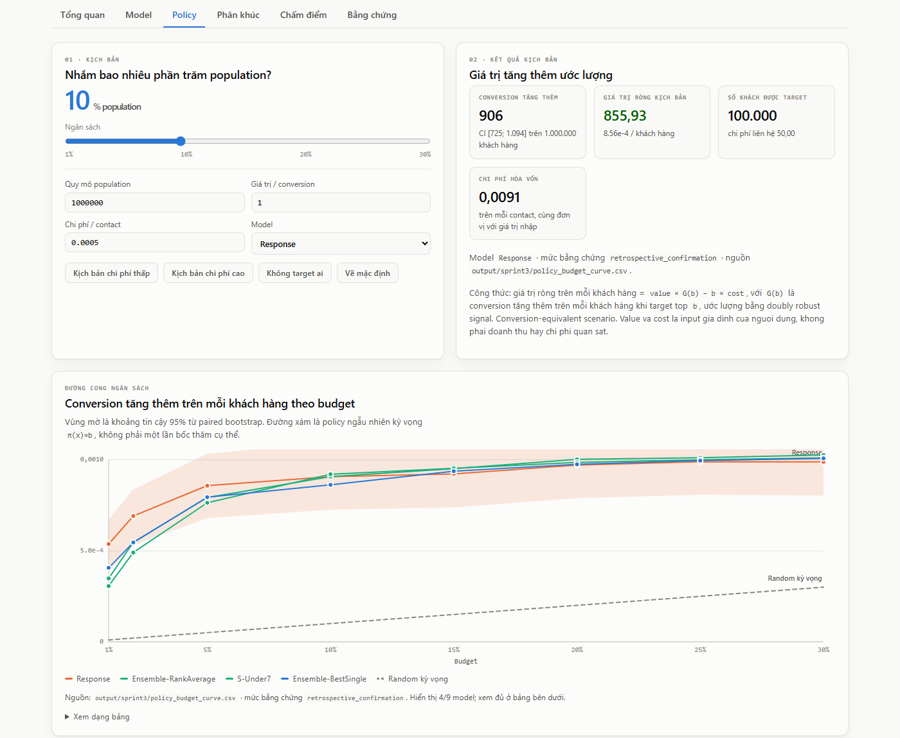
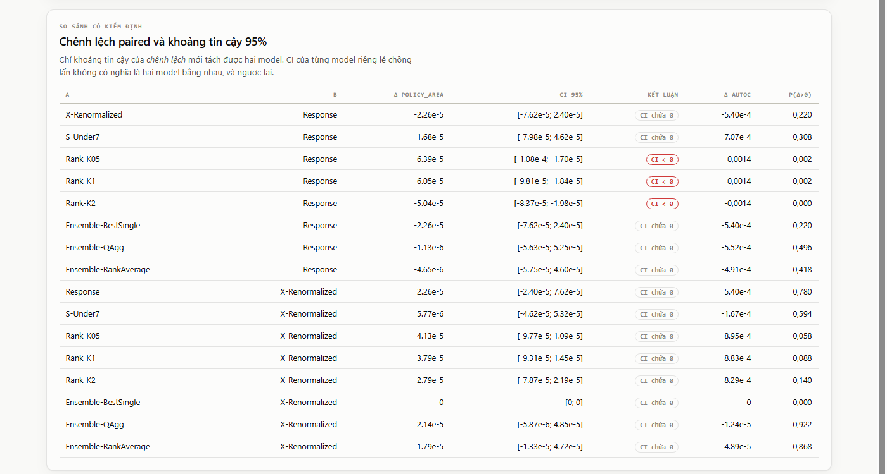
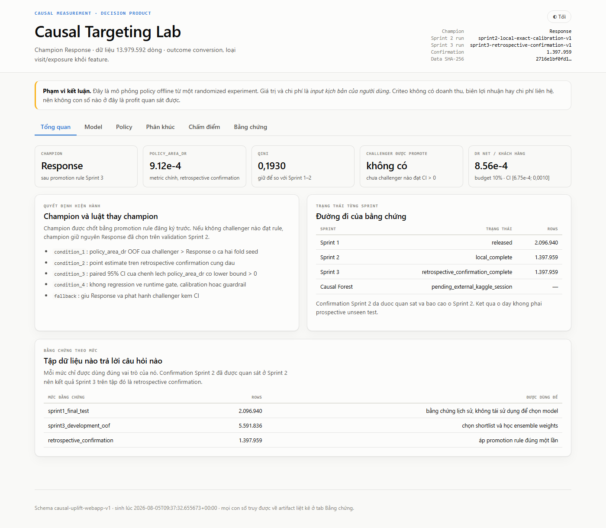

# Causal Uplift — chọn ai để target, và biết khi nào dữ liệu không cho phép trả lời

[](https://github.com/ThanhDatVN/Causal-Uplift-for-Activation-and-Retention/actions/workflows/tests.yml)
[](LICENSE)
[](pyproject.toml)

**Kết quả chính là một negative result đã được chứng minh, không phải một thí nghiệm thất
bại.** Sau chín vòng thí nghiệm trên 13,98 triệu dòng randomized experiment của Criteo,
không CATE learner nào — S/T/X/DR-Learner, R-Learner, Causal Forest, Rank-Learner,
ensemble — vượt được baseline dự đoán `P(conversion)`. Giá trị nằm ở chỗ dự án chỉ ra được
**vì sao**, bằng số: nửa khoảng tin cậy của phép đo là `±1,74e-05`, còn chênh lệch giữa các
model hàng đầu ở bậc `1e-06`. **Phép đo hết độ phân giải trước khi model hết dư địa.**

Kết luận đó kiểm chứng được, và nó là thứ giữ cho một tổ chức không triển khai một model
không thể phân biệt được với baseline. Ba hướng sửa độc lập — biểu diễn dữ liệu, estimator,
thuật toán — đều đã được kiểm và đều đóng; chi tiết ở
[docs/PROJECT_OVERVIEW.md](docs/PROJECT_OVERVIEW.md).

`Python 3.12` · `scikit-learn` · `LightGBM` · `EconML` · `scikit-uplift` · `FastAPI` ·
`Docker` · `pytest` · `GitHub Actions`

## Sản phẩm

Web app FastAPI + SPA (không CDN) và một dashboard HTML tự chứa. Cả hai **chỉ đọc artifact
đã phát hành**, không huấn luyện khi nhận request, nên con số trên sản phẩm không thể trôi
khỏi con số trong báo cáo.

Tab **Policy** — chọn ngân sách, đọc giá trị tăng thêm kèm khoảng tin cậy và điểm hòa vốn:



Tab **Model** — chênh lệch *ghép cặp* giữa từng challenger và champion. Đây là bằng chứng
của kết luận ở trên: hầu hết CI chứa 0, và ba biến thể Rank-Learner có CI hoàn toàn dưới 0:



Tab **Tổng quan** — champion hiện hành, metric chính, và luật thay champion đã đăng ký trước:



## Kết quả

Metric chính `policy_area_dr`: trung bình conversion tăng thêm trên mỗi khách hàng ở dải
ngân sách 1–30%, chấm bằng doubly robust signal trên 1.397.959 dòng confirmation.

| Model | `policy_area_dr` | AUTOC | Qini | Δ so Response, CI 95% |
|---|---:|---:|---:|---|
| **Response** (champion) | **0,000912** | 0,003823 | 0,192989 | — |
| Ensemble-QAgg | 0,000911 | 0,003271 | **0,209845** | `[-5,63e-05; 5,25e-05]` |
| S-Under7 | 0,000896 | 0,003116 | 0,205904 | `[-7,98e-05; 4,62e-05]` |
| X-Renormalized | 0,000890 | 0,003283 | 0,201812 | `[-7,62e-05; 2,40e-05]` |

Bảng đầy đủ, tám vòng thí nghiệm và tám báo cáo:
[docs/PROJECT_OVERVIEW.md](docs/PROJECT_OVERVIEW.md) · [report/](report/).

Lưu ý một tình huống hay bị bỏ qua: **theo Qini, ba model xếp trên Response; theo metric
chính và AUTOC, Response đứng đầu.** Metric hierarchy được đăng ký *trước* khi chạy chính là
để bất đồng này không trở thành một lựa chọn hậu nghiệm.

Ở ngân sách 10%, `value=1`, `cost=0,0005`: DR net `0,000856`/khách hàng, CI 95%
`[0,000675; 0,001044]`. Trên một triệu khách hàng, top 10% tương ứng khoảng **906
incremental conversion**, CI `[725; 1.094]`. Đây là *conversion-equivalent scenario*, không
phải doanh thu quan sát được.

## Vì sao kết luận này đứng vững

- **Đăng ký trước.** Metric chính, gate và promotion rule khóa trong `configs/` trước khi
  chạy; experiment registry ghi cả run bị dừng sớm.
- **So sánh có kiểm định.** Mọi kết luận dựa trên paired bootstrap CI của *chênh lệch*, không
  dựa trên point estimate. CI của hai model riêng lẻ chồng lấn không có nghĩa là chúng bằng nhau.
- **Cross-fitting và hai fold seed.** 3-fold OOF trên 5.591.836 dòng, lặp với seed 101/202;
  một challenger phải thắng ở *cả hai* seed mới được đi tiếp.
- **Chặn leakage ở tầng contract.** `visit` và `exposure` xảy ra sau treatment nên bị cấm làm
  feature; ràng buộc nằm trong một feature contract dùng chung, có test khóa lại.
- **Outcome hiếm được xử lý đúng.** Conversion rate 0,29%: undersampling có hiệu chỉnh ngược
  về thang xác suất gốc, `min_samples_leaf` tính theo số sự kiện control mỗi lá.

## Chạy thử

```powershell
docker compose build
docker compose run --rm tests        # tập test không cần dữ liệu gốc
docker compose up webapp             # mở http://localhost:8000
```

Không dùng Docker: `py -3.12 -m venv .venv`, cài `requirements.txt`, rồi
`.venv\Scripts\python.exe -m pytest tests -q` chạy 294 test, cộng 30 acceptance check trình
duyệt cho web app và 12 cho dashboard.

CI chạy phần không cần dữ liệu gốc (249 trong số đó) cộng acceptance test của dashboard.
Ba module còn lại cần file Criteo 300 MB, không commit được nên phải chạy ở máy có dữ liệu.
Runbook đầy đủ: [docs/REPRODUCTION.md](docs/REPRODUCTION.md).

## Repo

| Thư mục | Nội dung |
|---|---|
| [src/](src/README.md) | data contract, baseline và CATE learner, calibration, metric, policy evaluation, ensemble, registry |
| [scripts/](scripts/README.md) | mỗi vòng thí nghiệm một entrypoint, cộng acceptance test trình duyệt |
| [notebooks/](notebooks/README.md) | bốn notebook: EDA, modeling & evaluation, hai lần chạy Causal Forest trên Kaggle |
| [docs/](docs/README.md) | bảy method guide, decision contract, runbook, data card và model card |
| [report/](report/README.md) | tám báo cáo kết quả, đánh số theo thứ tự chạy |
| [webapp/](webapp/README.md) | API FastAPI và SPA |
| [tests/](tests/README.md) | 294 test, gồm cả test khóa tính toàn vẹn của tài liệu |

## Đọc tiếp

| Bạn cần | Mở |
|---|---|
| Toàn cảnh dự án, chi tiết chín giai đoạn | [docs/PROJECT_OVERVIEW.md](docs/PROJECT_OVERVIEW.md) |
| Vì sao dự án đi theo đúng thứ tự đó | [docs/END_TO_END_WORKFLOW.md](docs/END_TO_END_WORKFLOW.md) |
| Phương pháp, từ nền tảng uplift tới suy luận top-tail | [docs/README.md](docs/README.md) |
| Tra một thuật ngữ | [docs/GLOSSARY.md](docs/GLOSSARY.md) |

## Giấy phép

Code và tài liệu: [MIT](LICENSE). Dữ liệu Criteo **không** được phân phối lại ở đây và có
điều khoản riêng của Criteo AI Lab — xem
[data card](docs/cards/DATA_CARD_CRITEO_V2_1.md).
