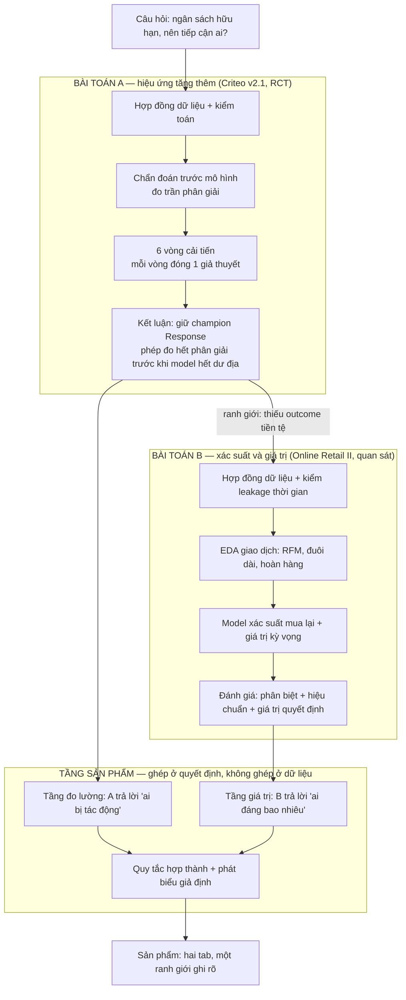
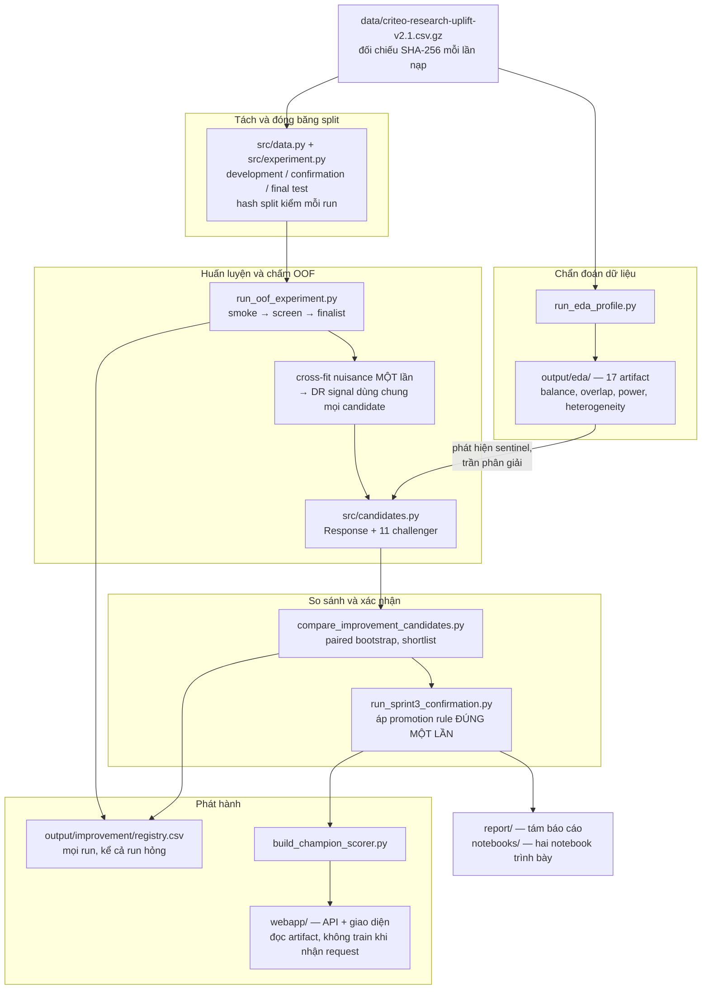
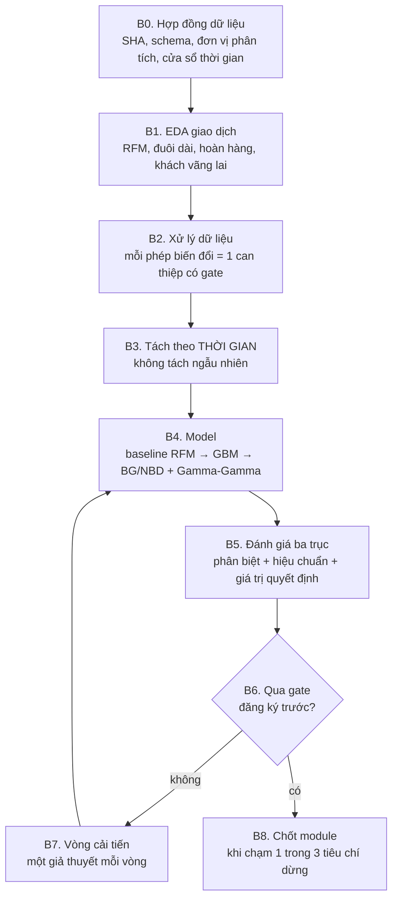
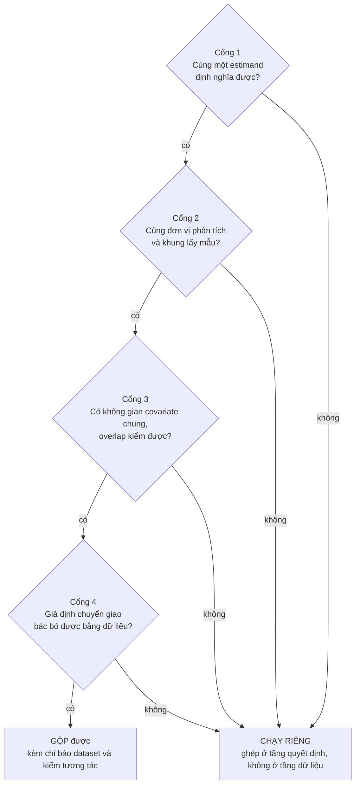
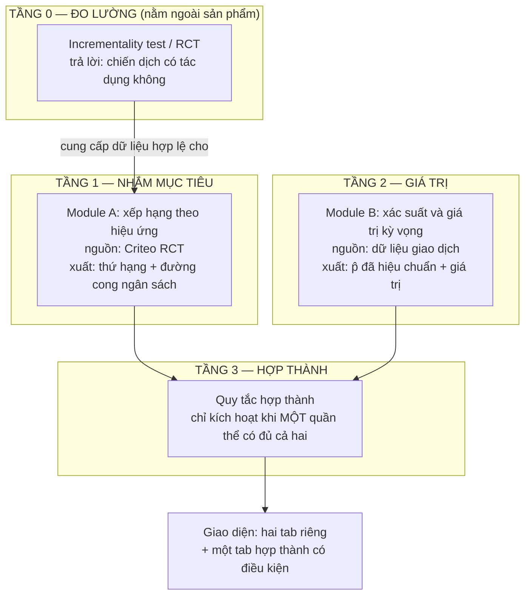
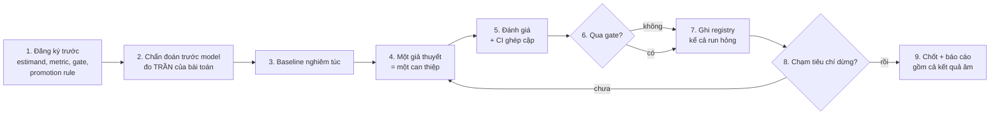

# Flow công việc toàn dự án — từ câu hỏi nhân quả đến sản phẩm hai tầng

- **Ngày:** 24/08/2026
- **Phạm vi:** toàn bộ mạch phát triển, gồm phần đã chạy (bài toán A) và phần đã đăng ký
  phạm vi nhưng chưa mở (bài toán B, tầng sản phẩm)
- **Quan hệ với tài liệu khác:** đây là **mạch nối**, không phải nguồn số. Mọi con số
  trích ở đây đều thuộc về một báo cáo trong [`../report/`](../report/) và truy được về
  một file trong [`../output/`](../output/)

## 0. Tài liệu này trả lời gì

Repo có tám báo cáo kết quả, sáu method guide và ba tài liệu nghiên cứu. Mỗi cái đúng
trong phạm vi của nó, nhưng không cái nào trả lời câu hỏi: **vì sao dự án đi theo đúng
thứ tự đó, và bước tiếp theo được suy ra từ đâu.**

Đây là câu hỏi mà người đọc lần đầu hỏi trước tiên, và là câu hỏi mà một hội đồng đánh
giá hỏi sau cùng. Tài liệu này trả lời nó bằng một mạch duy nhất: mỗi vòng thí nghiệm
**đóng lại đúng một giả thuyết** về việc vì sao phương pháp nhân quả không thắng baseline
dự đoán, và chính việc đóng lại đó sinh ra vòng kế tiếp. Khi cả ba hướng sửa độc lập đều
đóng, ranh giới lộ ra — và ranh giới đó là thứ định nghĩa bài toán thứ hai.

Ba thứ tài liệu này **không** làm: không thay báo cáo kết quả, không phát biểu số mới,
không thay [`REPRODUCTION.md`](REPRODUCTION.md) về mặt lệnh chạy.

## 1. Một câu hỏi, và vì sao nó quyết định mọi thứ phía sau

Câu hỏi kinh doanh: *với ngân sách chỉ đủ tiếp cận một phần khách hàng, nên tiếp cận ai?*

Có hai cách đọc câu hỏi này, và chúng dẫn tới hai đại lượng khác nhau:

| Cách đọc | Đại lượng | Quan sát được không |
|---|---|---|
| "Ai có khả năng mua nhất" | `p(x) = P(Y = 1 \| X = x)` | **Có.** Mỗi khách hàng có một nhãn |
| "Ai mua **nhờ** được tiếp cận" | `τ(x) = E[Y(1) - Y(0) \| X = x]` | **Không.** Mỗi khách hàng chỉ quan sát được một trong hai nhánh |

Toàn bộ độ khó của dự án nằm ở dòng thứ hai. `τ(x)` là hiệu của hai đại lượng không bao
giờ cùng quan sát được trên một cá nhân, nên **không có nhãn để chấm điểm ở mức cá nhân**.
Hệ quả dây chuyền, và mọi quyết định kỹ thuật sau này đều là hệ quả của nó:

1. không dùng được accuracy/RMSE trên `τ` — phải đánh giá ở mức **nhóm**, qua policy value
   hoặc đường cong xếp hạng;
2. cần **randomization** để `τ` được nhận dạng — nên dataset phải là RCT, không phải log
   quan sát;
3. mọi so sánh "model A hơn B" phải kèm **khoảng tin cậy ghép cặp**, vì đại lượng đích đã
   là một hiệu, và hiệu của hai ước lượng nhiễu thì nhiễu hơn nữa.

Ba ràng buộc này được chốt trước khi chạy dòng code mô hình đầu tiên, và chúng giải thích
vì sao repo trông như hiện tại: một protocol đăng ký trước cho mỗi vòng, một registry ghi
cả run thất bại, và một quy tắc "không claim nếu CI chứa 0".

Chi tiết lý thuyết: [`SPRINT_1_THEORY_AND_METHOD_GUIDE.md`](SPRINT_1_THEORY_AND_METHOD_GUIDE.md).

## 2. Sơ đồ toàn cảnh



Ba điều cần đọc ra từ sơ đồ, vì chúng là ba quyết định gây tranh cãi nhất của dự án:

- **A và B không nối với nhau ở tầng dữ liệu.** Mũi tên duy nhất từ A sang B là mũi tên
  *lý do*: A chạm ranh giới nào thì B được mở ra để lấp đúng ranh giới đó. Không có luồng
  dữ liệu nào chảy từ A sang B hay ngược lại. Mục 6 chứng minh vì sao đó là bắt buộc chứ
  không phải lựa chọn thẩm mỹ.
- **Chẩn đoán đứng trước mô hình**, không phải sau. Bước A1 dự đoán trước kết quả của cả
  sáu vòng A2. Nếu nó đứng sau, nó đã thành lời biện minh hậu nghiệm.
- **Sản phẩm ghép ở tầng quyết định.** Đó là chỗ duy nhất hai bài toán gặp nhau một cách
  hợp lệ, và ngay tại đó vẫn phải phát biểu giả định.

## 3. Bài toán A — vòng lặp đã chạy

### 3.0 Pipeline kỹ thuật — bản đồ từ file dữ liệu tới artifact

Mục 3.1 trở đi nói về *mạch suy luận*. Mục này nói về *đường đi của dữ liệu*, để hai thứ
không bị lẫn. Lệnh chạy đầy đủ nằm ở [`REPRODUCTION.md`](REPRODUCTION.md); ở đây chỉ là
bản đồ.



Ba ràng buộc kiến trúc đáng chú ý, vì chúng là thứ giữ cho kết quả tái lập được:

| Ràng buộc | Hiện thực ở đâu | Nó ngăn điều gì |
|---|---|---|
| Nuisance cross-fit **một lần**, dùng chung cho mọi candidate | [`../scripts/run_oof_experiment.py`](../scripts/run_oof_experiment.py) | chênh lệch giữa hai model lẫn với chênh lệch giữa hai tín hiệu chấm điểm |
| Hash split đối chiếu trước mỗi run | [`../src/experiment.py`](../src/experiment.py) | hai lần chạy tưởng là so được nhưng thực ra khác dữ liệu |
| Tầng trình bày chỉ **đọc** artifact | [`../webapp/`](../webapp/), notebook 02 | con số trên báo cáo và trên sản phẩm trôi khỏi nhau |

Mũi tên từ khối chẩn đoán sang khối huấn luyện là mũi tên quan trọng nhất trong sơ đồ:
phát hiện sentinel ở bước EDA về sau trở thành vòng cải tiến thứ tư, và trần phân giải đo
ở bước EDA là thứ giải thích kết quả của cả sáu vòng.

### 3.1 Bước 0 — hợp đồng dữ liệu, chốt trước khi nhìn kết quả

Criteo Uplift v2.1: `13.979.592` dòng, 12 feature ẩn danh, treatment `85%`, conversion
`0,2917%`. Chi tiết nguồn gốc và giới hạn: [`data_cards/CRITEO_V2_1.md`](data_cards/CRITEO_V2_1.md).

Bốn điều được chốt ở bước này, và cả bốn về sau đều có lần cứu dự án khỏi một kết luận sai:

| Điều chốt | Nội dung | Nó chặn được gì |
|---|---|---|
| Estimand | hiệu ứng tăng thêm lên `conversion` | ngăn việc âm thầm đổi sang outcome dễ hơn khi kết quả xấu |
| Biến cấm | `visit` và `exposure` là biến **hậu can thiệp**, cấm làm feature | leakage làm model trông giỏi mà không có giá trị nhân quả |
| Ba tập | development `5.591.836` / confirmation `1.397.959` / final test Sprint 1 `2.096.940`, đối chiếu hash mỗi lần chạy | tái sử dụng tập đã nhìn, tức tune vào test |
| Registry | mọi run vào [`../output/improvement/registry.csv`](../output/improvement/registry.csv), **kể cả run hỏng** | báo cáo chỉ những lần chạy đẹp |

Registry hiện có `97` run trên `24` candidate: `44` screen, `23` smoke, `16` finalist,
`9` confirmation, `2` diagnostic, `2` **failed**, `1` released. Hai dòng `failed` là phần
đáng giá nhất của bảng này — chúng là bằng chứng rằng gate tự động thực sự có kích hoạt,
chứ không phải một điều khoản trang trí.

### 3.2 Bước 1 — chẩn đoán đứng trước mô hình, và nó đã dự đoán trước kết quả

Đây là bước quyết định tính mạch lạc của cả dự án. Trước khi fit model đầu tiên, bước
chẩn đoán ([`../scripts/run_eda_profile.py`](../scripts/run_eda_profile.py), trình bày ở
[`../notebooks/01_eda_criteo.ipynb`](../notebooks/01_eda_criteo.ipynb)) đo ba thứ.

**Một — hiệu ứng trung bình có thật và được đo rất chắc.** ATE `0,11519` điểm phần trăm,
CI `[0,10845%; 0,12192%]`, risk ratio `1,594`. Không có gì mơ hồ ở mức trung bình.

**Hai — nhưng nó nhỏ tuyệt đối, và policy làm việc với giá trị tuyệt đối.** `0,3089%` so
với `0,1938%`. Chênh lệch `0,00115` chính là toàn bộ ngân sách tín hiệu mà mọi CATE
learner phải chia nhỏ tiếp theo `x`.

**Ba — trần phân giải.** [`../output/eda/power_analysis.csv`](../output/eda/power_analysis.csv)
cho biết: phát hiện hiệu ứng bằng `1/10` ATE cần `8,97e06` dòng, vừa đủ trong `13,98`
triệu dòng hiện có. Nhưng `1/100` ATE cần `8,97e08`, tức **64 lần** toàn bộ dataset.

Ba con số đó nói trước một điều: dự án sẽ trả lời chắc chắn câu *treatment có tác dụng
không*, và chỉ trả lời được ở độ phân giải thô câu *tác dụng với ai nhiều hơn*. Sáu vòng
cải tiến sau đó là hệ quả của ràng buộc này, không phải của việc chọn sai model.

Bước chẩn đoán còn đo một thứ nữa, và nó là **cơ chế** giải thích mọi kết quả về sau:
hiệu ứng gần như tỉ lệ thuận với rủi ro nền, `τ(x) ≈ 0,53 · p₀(x)`. Trên 26 pattern
sentinel **rời nhau**, Pearson `0,769` và Spearman `0,883`. Quyết định hơn cả hai con số
đó: Cochran `Q` giảm từ `861` trên thang cộng xuống `150` trên thang nhân, tỷ lệ `5,7`
lần — tức phần lớn tính không đồng nhất biến mất khi đổi thang.

Nói cách khác: hiệu ứng *có* thay đổi theo `x`, nhưng chủ yếu theo đúng cách mà `p₀(x)`
thay đổi. Mà `p₀` chính là thứ baseline Response ước lượng trực tiếp và ước lượng tốt.
**Đây là lý do Response khó bị đánh bại, và nó được đo trên dữ liệu thô, trước mọi model.**

### 3.3 Sáu vòng — mỗi vòng đóng một giả thuyết

Mạch phát triển không phải "thử thêm model cho tới khi thắng". Nó là một chuỗi loại trừ:
mỗi vòng nhận một giả thuyết cụ thể về *vì sao* nhân quả chưa thắng, can thiệp đúng vào
giả thuyết đó, và đóng nó lại bằng bằng chứng.

```mermaid
flowchart LR
    H0["Vì sao CATE learner<br/>không thắng Response?"]
    H1["H1: chọn model<br/>chưa đủ chặt"]
    H2["H2: metric sai<br/>trọng tâm"]
    H3["H3: biểu diễn<br/>dữ liệu thiếu"]
    H4["H4: estimator<br/>sai thang"]
    H5["H5: sai vùng<br/>ngân sách"]
    H6["H6: cần thuật toán<br/>chuyên dụng"]
    H7["H7: thuật toán đó<br/>bị đặt sai cấu hình"]
    R["Còn lại: ràng buộc<br/>nằm ở PHÉP ĐO"]

    H0 --> H1 -->|"Sprint 1-2"| H2
    H2 -->|"Sprint 3"| H3
    H3 -->|"data optimization"| H4
    H4 -->|"causal foundation"| H5
    H5 -->|"top-tail v2"| H6
    H6 -->|"causal forest 20/30/50%"| H7
    H7 -->|"causal forest rare-outcome"| R
```



Bảng dưới là cùng một mạch, kèm bằng chứng đóng của từng bước:

| # | Giả thuyết được kiểm | Can thiệp | Kết quả | Điều nó đóng lại | Câu hỏi nó mở ra |
|---|---|---|---|---|---|
| 1 | Sprint 1 — chọn model chưa đủ chặt | 5 model, gate `median ΔQini ≥ 0,005` trên 3 seed validation | 2 candidate thắng validation **đổi dấu** trên test | gate theo point estimate trên một pool là không đủ | vậy chọn model bằng gì |
| 2 | Sprint 2 — cần tầng quyết định và CI | policy value DR, 500 paired bootstrap, confirmation mới | X-Renormalized cao hơn nhưng CI chứa 0; giữ Response theo hợp đồng | point estimate cao hơn không phải bằng chứng | metric chính có đang đo đúng thứ cần không |
| 3 | Sprint 3 — metric sai trọng tâm | đổi metric chính Qini sang `policy_area_dr`, cross-fitting OOF, hai fold seed, promotion rule bốn điều kiện | 12 candidate, không ai promote. **Qini và metric chính xếp ngược nhau** | Qini không phải metric quyết định cho bài toán ngân sách | nếu không phải metric, có phải biểu diễn dữ liệu |
| 4 | Data optimization — biểu diễn thiếu cấu trúc | đưa point mass và sentinel phát hiện trong EDA thành feature tường minh | Response-Sentinel qua screen, **trượt gate ổn định ở full** | biểu diễn dữ liệu không phải nút thắt | có phải estimator sai thang |
| 5 | Causal foundation — estimator sai thang | DINA học trên log-odds, Anchored R giữ neo tiên lượng, Pattern R gộp một phần theo 53 pattern | không candidate nào thắng ở cả hai seed; đổi dấu theo seed | đúng thang chưa đủ để khử phương sai xếp hạng | có phải đang nhìn sai vùng ngân sách |
| 6 | Top-tail v2 — sai vùng ngân sách | audit riêng budget `1%` và `2%`, familywise simultaneous band trên họ 20 ô | `16/16` point delta dương, **`0/16`** cận dưới vượt 0 | tín hiệu ở đuôi là giả thuyết, không phải bằng chứng | có phải cần một thuật toán chuyên dụng ngoài họ meta-learner |
| 7 | Causal Forest — cần một thuật toán chuyên dụng ngoài họ meta-learner | `CausalForestDML` ba mốc dữ liệu 20/30/50%, chấm trên cùng holdout Sprint 1 | `policy_area_dr` hạng `1/6`, Qini hạng `3/6`, CI chứa 0 | thuật toán chuyên dụng cũng không tách được khỏi baseline | có phải chỉ vì cấu hình đặt sai cho outcome hiếm |
| 8 | Causal Forest rare-outcome | `min_samples_leaf` từ `500` lên `10.000`, chạy trên split Sprint 2/3, chấm bằng DR signal đóng băng | hạng `1/10` theo metric chính nhưng CI chứa 0, tức hòa | cấu hình cho outcome hiếm không phải nút thắt | *(không còn giả thuyết phía model)* |

Tám dòng: hai dòng đầu là nền tảng, sáu dòng sau là sáu vòng cải tiến. Sau
dòng cuối, **không còn giả thuyết nào phía model chưa bị kiểm**. Ba hướng sửa độc lập —
biểu diễn dữ liệu, estimator, thuật toán — đều đóng. Đó là lúc kết luận đổi từ "chưa tìm
được model tốt hơn" thành một phát biểu mạnh hơn và kiểm chứng được: **phép đo hết độ
phân giải trước khi model hết dư địa.**

Bằng chứng số cho phát biểu đó: trên confirmation, độ phân giải của `policy_area_dr` là
khoảng `±1,74e-05`, trong khi chênh lệch giữa các model hàng đầu nằm ở bậc `1e-06` — nhỏ
hơn một bậc độ lớn so với thứ đo được.

### 3.4 Hai lần điều chỉnh metric, và cách làm điều đó mà không thành p-hacking

Dự án đổi metric chính **một lần** và sửa cách phát biểu về độ nhạy **một lần**. Cả hai
đều là thời điểm dễ mất tính chính trực nhất, nên cách xử lý được ghi lại đầy đủ.

**Lần 1 — Qini sang `policy_area_dr` ở Sprint 3.** Lý do không phải "Qini cho kết quả
xấu", mà là Qini tích hợp trên toàn dải `0-100%` trong khi quyết định thật chỉ dùng dải
`1-30%`. Ba điều làm cho việc đổi này hợp lệ:

1. đổi **trước** khi chạy, ghi trong [`../configs/sprint3_improvement_protocol.json`](../configs/sprint3_improvement_protocol.json);
2. Qini **vẫn được báo cáo** làm metric phụ, không bị bỏ đi;
3. khi hai metric xếp ngược nhau, kết luận theo metric đã đăng ký trước, và **bất đồng đó
   được báo cáo như một phát hiện** chứ không bị giấu.

Điểm 3 là chỗ giao thức chứng minh giá trị của nó: trên confirmation, bốn model có Qini
cao hơn Response nhưng `policy_area_dr` thấp hơn. Nếu Qini vẫn là metric chính, kết luận
của cả dự án đã đảo chiều. Việc đăng ký trước là thứ duy nhất ngăn được lựa chọn hậu
nghiệm ở đây.

**Lần 2 — bỏ cách phát biểu "cần 2.123 lần toàn bộ Criteo", ngày 14/08/2026.** Con số đó
dùng công thức `n · (nửa CI / Δ)²`, tức **chia cho một point estimate mà chính nó không
phân biệt được với 0**. Cùng công thức, cùng dữ liệu, chỉ đổi tín hiệu chấm điểm từ IPW
sang DR thì ra `1,8×` thay vì `2.123×`, chênh gần `7.800` lần. Cách sửa: phát biểu bằng
**độ rộng CI**, không bằng tỷ lệ dữ liệu cần thêm. Đính chính được ghi tại chỗ trong
[`../report/README.md`](../report/README.md) thay vì sửa lặng lẽ.

Vòng cuối còn phát hiện thêm một điều đắt hơn cả hai lần trên: **thứ hạng theo point
estimate không ổn định khi đổi tín hiệu chấm điểm.** Chấm lại cùng một bộ điểm, trên cùng
những dòng dữ liệu, chỉ đổi IPW sang DR, làm Response tụt từ hạng 2 xuống hạng 4 trên sáu
model, dù mọi paired CI trong nhóm đầu đều chứa 0. Bài học vận hành: **cố định và ghi rõ
tín hiệu chấm điểm trước khi so sánh bất cứ thứ gì**, ngang hàng với việc cố định metric.

### 3.5 Xử lý dữ liệu được đối xử như một can thiệp, không phải bước chuẩn bị

Trong flow này, xử lý dữ liệu không nằm ở đầu như một bước tiền xử lý mặc định. Nó là
**vòng 4**, một can thiệp có giả thuyết riêng và gate riêng.

Lý do: EDA phát hiện các point mass là **sentinel value** chứ không phải mức thật của
biến. Nếu chỉ coi đó là chuyện làm sạch dữ liệu, ta sẽ âm thầm impute hoặc bỏ, và mất
thông tin. Coi nó là giả thuyết — *biểu diễn tường minh cấu trúc sentinel sẽ giải phóng
tín hiệu nhân quả* — thì nó được kiểm bằng đúng bộ gate như mọi model khác, và kết quả là
một câu trả lời dùng được: qua screen, trượt ổn định ở full.

Nguyên tắc rút ra, áp dụng cho cả bài toán B: **mọi phép biến đổi dữ liệu làm đổi kết quả
đều là một can thiệp và phải qua gate.** Chỉ những phép không đổi kết quả — ép kiểu, đối
chiếu checksum — mới thuộc về bước chuẩn bị.

### 3.6 Khi nào dừng một module — tiêu chí dừng đo được

"Lặp đến khi tốt nhất" cần một định nghĩa, nếu không nó thành lặp vô hạn. Dự án dùng ba
điều kiện dừng, và chỉ cần **một** điều kiện đúng là dừng:

| Điều kiện dừng | Cách đo | Trạng thái của bài toán A |
|---|---|---|
| **Hết phân giải** — nửa độ rộng CI lớn hơn mọi cải thiện còn hợp lý | so nửa CI với chênh lệch giữa các model hàng đầu | **Đã chạm.** `±1,74e-05` so với bậc `1e-06` |
| **Hết giả thuyết** — mọi giả thuyết đã đăng ký về nguyên nhân đều bị đóng | bảng ở mục 3.3 | **Đã chạm.** 7/7 đóng |
| **Hết giá trị biên** — N vòng liên tiếp không candidate nào qua gate | registry | **Đã chạm.** 6 vòng, 0 promote |

Cả ba cùng đúng. Đó là lý do bài toán A **đóng lại có căn cứ** chứ không phải bị bỏ dở. Và
quan trọng cho mạch tài liệu này: điều kiện dừng thứ nhất chỉ thẳng ra thứ còn thiếu —
không phải một model tốt hơn, mà là **một phép đo có độ phân giải cao hơn**.

## 4. Ranh giới của bài toán A, và nó định nghĩa bài toán B như thế nào

Điều kiện dừng ở mục 3.6 không nói "hết cách". Nó nói chính xác cái gì còn thiếu. Viết
thành bốn điều kiện mà một dataset phải có để đẩy bài toán A đi tiếp:

| Điều kiện | Vì sao cần | Criteo v2.1 |
|---|---|---|
| **(a)** treatment được randomize | để `τ` được nhận dạng mà không cần giả định về confounding | **Có** |
| **(b)** outcome tiền tệ | để xếp hạng theo *giá trị* tăng thêm, không chỉ theo *xác suất* tăng thêm | **Không.** Chỉ có nhãn nhị phân |
| **(c)** đủ số sự kiện | để CI hẹp hơn chênh lệch giữa các model | **Không đủ.** `1.625` conversion ở nhánh control của development pool |
| **(d)** feature diễn giải được | để nói được *ai* được chọn, không chỉ *bao nhiêu người* | **Không.** 12 biến ẩn danh |

Criteo đạt đúng một trong bốn. Đó là toàn bộ lý do kỹ thuật để mở một dataset thứ hai —
**không phải** vì muốn thử thêm phương pháp. Nguyên tắc này đã được ghi từ trước trong
[`../planning/RESEARCH_LANDSCAPE_2026.md`](../planning/RESEARCH_LANDSCAPE_2026.md) mục 3.1:
*cần một dataset có outcome tiền tệ; Criteo không có*.

Bộ dữ liệu thứ hai đã có sẵn trong repo là `online_retail_II.xlsx` trong thư mục `data/`.
Đo trực tiếp, không dựa vào mô tả của nguồn:

| Hạng mục | Giá trị đo được |
|---|---|
| Kích thước | `45.622.278` byte |
| SHA-256 | `bcbe73b35f5b7babf197fb0cb983a11f5d9ff929078d4aa53d171b1f2df2e980` |
| Sheet | `Year 2009-2010` và `Year 2010-2011` |
| Số dòng dữ liệu | `525.461` + `541.910` = **`1.067.371`** |
| Cột | `Invoice`, `StockCode`, `Description`, `Quantity`, `InvoiceDate`, `Price`, `Customer ID`, `Country` |
| Cột treatment | **không có** |

Đối chiếu với bốn điều kiện:

| Điều kiện | Online Retail II |
|---|---|
| (a) randomize | **Không.** Không có cột treatment, không có thiết kế thí nghiệm |
| (b) outcome tiền tệ | **Có.** `Quantity × Price` |
| (c) đủ sự kiện | **Có.** Hơn một triệu dòng giao dịch, hai năm |
| (d) feature diễn giải được | **Có.** Sản phẩm, quốc gia, thời gian, giá |

Đây là kết luận quan trọng nhất của cả tài liệu, và nó phải được phát biểu thẳng:
**Online Retail II bù đúng ba điều kiện mà Criteo thiếu, nhưng làm hỏng điều kiện duy
nhất mà Criteo có.** Nó không kéo dài bài toán A được một bước nào. Nó chỉ mở được một
bài toán **khác**, và bài toán đó phải được gọi đúng tên ngay từ đầu.

## 5. Bài toán B — xác suất và giá trị trên dữ liệu quan sát

### 5.1 Bài toán B là gì, và dứt khoát không là gì

**Là:** với một khách hàng đã có lịch sử giao dịch, ước lượng xác suất họ còn hoạt động
và còn mua trong cửa sổ tương lai, cùng giá trị kỳ vọng của phần mua đó.

**Không là:** bất kỳ phát biểu nào có chữ *tăng thêm*, *nhờ*, *do chiến dịch*. Không có
treatment thì không có `Y(1)` và `Y(0)`, nên không có `τ`. Mọi con số của bài toán B là
**dự báo**, không phải **hiệu ứng**.

Ranh giới này phải nằm trong tên biến, tên cột artifact và nhãn trên giao diện, không chỉ
trong một đoạn văn cảnh báo. Kinh nghiệm của bài toán A cho thấy chỗ dễ trượt nhất là
ngôn ngữ: chỉ cần gọi `p̂` là "giá trị khách hàng mang lại" là người đọc đã hiểu thành
nhân quả.

### 5.2 Vì sao bài toán B vẫn đáng làm khi nó không nhân quả

Ba lý do, xếp theo sức nặng:

1. **Nó là tầng còn thiếu của sản phẩm.** Bài toán A xếp hạng theo hiệu ứng nhưng không
   biết mỗi người đáng bao nhiêu tiền. Một chính sách ngân sách thật cần cả hai.
2. **Nó có ground truth ở mức cá nhân.** Khác hẳn A: ở đây mỗi khách hàng *có* nhãn tương
   lai quan sát được. Nên nó cho phép làm những thứ A không cho phép — hiệu chuẩn xác
   suất, đo sai số cá nhân, backtest theo thời gian.
3. **Nó kiểm tra lại chính giao thức của A trên một chế độ khác.** Nếu bộ gate và kỷ luật
   đăng ký trước chỉ hoạt động trên bài toán tín hiệu yếu, chúng chưa chứng minh được gì.

### 5.3 Pipeline đầy đủ của bài toán B



**B0 — hợp đồng dữ liệu.** Chốt trước, bằng đúng kỷ luật của mục 3.1:

| Mục | Quyết định phải chốt trước |
|---|---|
| Đơn vị phân tích | dòng giao dịch gộp lên **khách hàng**; khách không có `Customer ID` bị loại và **ghi lại tỷ lệ loại** |
| Outcome | chốt **một** định nghĩa: có mua trong cửa sổ `H` ngày tới, và doanh thu ròng trong cửa sổ đó |
| Cửa sổ `H` | chốt bằng số, trước khi nhìn kết quả. Đổi `H` sau khi thấy kết quả là p-hacking |
| Hoàn hàng | `Invoice` bắt đầu bằng `C` và `Quantity < 0` là hủy đơn. Chốt: trừ vào doanh thu hay loại bỏ |
| Biến cấm | mọi thứ tính từ **sau** mốc cắt thời gian. Đây là bản sao của luật `visit`/`exposure` ở bài toán A |
| Quốc gia | phân bố lệch mạnh về một thị trường; chốt trước là lọc hay giữ và đưa vào feature |

**B1 — EDA.** Mục tiêu giống mục 3.2: tìm ra **trần** trước khi chạy model. Cụ thể cần
đo: phân bố RFM, độ dài đuôi của giá trị đơn hàng, tỷ lệ hoàn hàng, tỷ lệ khách chỉ mua
một lần, và số khách còn sống sót qua mốc cắt. Con số cuối cùng là trần của bài toán:
nếu quá ít khách có giao dịch ở cả hai cửa sổ, mọi model đều bị chặn trên như nhau.

**B2 — xử lý dữ liệu.** Áp nguyên tắc ở mục 3.5: phép biến đổi nào làm đổi kết quả thì
phải qua gate. Với dữ liệu bán lẻ, ba phép hay bị coi nhầm là chuẩn bị nhưng thực chất là
can thiệp: cắt ngưỡng outlier giá trị đơn, gộp `StockCode` thành nhóm sản phẩm, và cách
xử lý hoàn hàng.

**B3 — tách theo thời gian, không tách ngẫu nhiên.** Đây là khác biệt lớn nhất so với bài
toán A. A tách ngẫu nhiên vì đó là RCT và câu hỏi không có chiều thời gian. B là bài toán
**dự báo**, nên tách ngẫu nhiên sẽ để model nhìn thấy tương lai của chính khách hàng đó.
Bộ dữ liệu có sẵn hai năm tách rời, nên thiết kế tự nhiên là huấn luyện trên cửa sổ sớm
và đánh giá trên cửa sổ muộn, cộng thêm rolling-origin để không phụ thuộc một mốc cắt.

**B4 — họ model, xếp theo độ phức tạp tăng dần.** Bài học lớn nhất của bài toán A là
baseline đơn giản rất khó bị đánh bại, nên baseline phải được dựng nghiêm túc chứ không
phải để làm nền:

| Bậc | Model | Vai trò |
|---|---|---|
| 0 | quy tắc recency thuần | sàn tuyệt đối. Nếu model học máy không vượt được nó thì dừng |
| 1 | RFM rời rạc hóa | baseline nghiệp vụ, diễn giải được |
| 2 | GBM trên feature RFM mở rộng | baseline học máy |
| 3 | BG/NBD cho xác suất còn hoạt động, Gamma-Gamma cho giá trị đơn | model xác suất có cấu trúc; cho `P(còn hoạt động)` diễn giải được |
| 4 | kết hợp bậc 2 và bậc 3 | chỉ mở nếu bậc 2 và 3 hơn nhau ở những phân khúc khác nhau |

**B5 — ba trục đánh giá, và trục thứ hai là trục mà bài toán A không có.**

| Trục | Đo bằng | Vì sao bắt buộc |
|---|---|---|
| Phân biệt | AUC và PR-AUC | outcome mất cân bằng nên PR-AUC nói nhiều hơn AUC |
| **Hiệu chuẩn** | Brier score, reliability curve, ECE | **Sản phẩm sẽ nhân xác suất với tiền.** Một model xếp hạng đúng nhưng lệch thang sẽ cho ra con số tiền sai |
| Giá trị quyết định | doanh thu thu được ở top `k`, quét trên dải `k` giống dải budget của A | để so được với tầng A trên cùng một trục quyết định |

Trục hiệu chuẩn là điều kiện tiên quyết cho mục 7. Nếu bỏ nó, tầng sản phẩm mất cơ sở.

**B6 — gate đăng ký trước.** Sao chép cấu trúc promotion rule của bài toán A, đổi nội
dung cho hợp bài toán dự báo: challenger phải thắng baseline trên metric chính ở **mọi**
mốc cắt thời gian, CI ghép cặp phải loại 0, và **không được xấu đi về hiệu chuẩn**. Điều
kiện cuối cùng là thứ ngăn việc đổi lấy chút AUC bằng cách phá thang xác suất.

**B7 — vòng cải tiến.** Cùng khuôn với mục 3.3: mỗi vòng một giả thuyết. Thứ tự đề nghị,
xếp theo tỷ lệ giá trị trên chi phí, và **đăng ký trước khi chạy vòng đầu**:

1. đặc trưng thời gian: khoảng cách giữa các lần mua, xu hướng tần suất;
2. giỏ hàng: đa dạng sản phẩm, nhóm hàng, độ nhạy giá;
3. xử lý đuôi dài của giá trị đơn — biến đổi log hoặc mục tiêu ZILN;
4. mô hình hai phần tách bạch: xác suất mua nhân giá trị kỳ vọng khi mua.

**B8 — dừng.** Dùng lại đúng ba tiêu chí ở mục 3.6. Với bài toán B, tiêu chí "hết phân
giải" đo bằng độ rộng CI của metric quyết định giữa hai mốc cắt thời gian liền nhau: khi
biến động giữa hai mốc lớn hơn khoảng cách giữa các model, việc xếp hạng model thêm nữa
không còn ý nghĩa.

### 5.4 Điều bài toán B sẽ vấp, dự đoán trước

Bài toán A ghi lại trần của nó *trước* khi chạy, và điều đó làm kết quả đáng tin hơn
nhiều. Làm đúng như vậy cho B, hai dự đoán đăng ký trước:

- **Chế độ thất bại của B khác A.** A bị chặn bởi *độ phân giải*. B nhiều khả năng bị
  chặn bởi *đặc tả*: chọn `H` bao nhiêu, tính hoàn hàng thế nào, có lọc thị trường không.
  Kết quả sẽ nhạy với những lựa chọn này hơn là với việc chọn model. Đó là lý do chúng
  phải được chốt ở B0 chứ không phải điều chỉnh dần.
- **Baseline recency sẽ rất mạnh.** Cùng cơ chế đã thấy ở A: khi tín hiệu chủ đạo là một
  đại lượng đơn giản quan sát được trực tiếp, model phức tạp chỉ học lại chính nó kèm
  thêm nhiễu. Nếu điều này xảy ra, đó là **kết quả**, không phải thất bại — và nó củng cố
  phát hiện trung tâm của cả dự án.

## 6. Hai dataset khác nhau — ghép hay không, và trả lời thế nào cho thuyết phục

Đây là câu hỏi khó nhất của dự án, vì câu trả lời đúng là một câu **từ chối**, và một câu
từ chối chỉ thuyết phục khi nó đến từ một quy trình chứ không từ cảm tính.

### 6.1 Ba cách ghép thường gặp, và mỗi cách hỏng ở đâu

| Cách ghép | Ý tưởng | Hỏng ở đâu |
|---|---|---|
| **Gộp dòng** | nối hai bảng thành một tập huấn luyện lớn hơn | Hai bảng không cùng **đơn vị phân tích**: một bên là lượt hiển thị quảng cáo trong một thí nghiệm, một bên là dòng hóa đơn bán lẻ. Không cùng khung lấy mẫu, không cùng quần thể, không có cột nào trùng nghĩa. Phép nối này không có nghĩa trước cả khi nói tới thống kê |
| **Chuyển giao hiệu ứng** | học `τ(x)` trên Criteo rồi áp cho khách hàng bán lẻ | Chuyển giao cần một **không gian covariate chung** và giả định các biến điều tiết hiệu ứng phân bố như nhau. Criteo có 12 biến **ẩn danh**, không ánh xạ được sang RFM. Không có covariate chung thì giả định chuyển giao **không kiểm được, cũng không nhận dạng được** — đây là bất khả về mặt nhận dạng, không phải khó về mặt kỹ thuật |
| **Nhân hai đại lượng** | lấy `τ` từ Criteo nhân với giá trị khách hàng từ bán lẻ, gọi là *incremental CLV* | Hai thừa số được định nghĩa trên **hai quần thể khác nhau**, nên tích của chúng không phải một đại lượng của quần thể nào. Ngoài ra còn dính **surrogate paradox**: ngay cả khi treatment được randomize, confounding giữa đại lượng thay thế ngắn hạn và outcome dài hạn có thể làm kết luận sai **dấu** |

Cách thứ ba là cách hấp dẫn nhất và nguy hiểm nhất, vì nó cho ra một con số trông rất
dùng được. Repo đã ghi cảnh báo cho đúng tình huống này từ trước, kèm tên hai dataset,
trong [`../planning/RESEARCH_LANDSCAPE_2026.md`](../planning/RESEARCH_LANDSCAPE_2026.md)
mục 3.2, và chốt thành luật ở mục 5 của cùng tài liệu: **không ghép dataset để tạo ra một
estimand không quan sát được.**

### 6.2 Bốn cổng quyết định — quy trình dùng lại được cho bất kỳ cặp dataset nào

Đừng trả lời câu hỏi ghép dataset bằng trực giác. Chạy qua bốn cổng, theo thứ tự. **Rớt
bất kỳ cổng nào thì dừng ở đó và chạy riêng.**



| Cổng | Câu hỏi | Cách kiểm bằng dữ liệu |
|---|---|---|
| 1 | Sau khi gộp, con số thu được là ước lượng của **đại lượng nào**, trên **quần thể nào**? | Viết ra công thức estimand. Nếu không viết được thành một kỳ vọng trên một quần thể xác định thì đã rớt |
| 2 | Một dòng ở bảng A và một dòng ở bảng B có phải cùng loại đối tượng? | So định nghĩa đơn vị, cách chọn mẫu, cửa sổ thời gian |
| 3 | Có tập feature nào cùng nghĩa ở hai bên, và phân bố có chồng lấn? | Xem mục 6.4 — SMD từng biến, phân số common support, và AUC của bộ phân biệt dataset |
| 4 | Giả định "hiệu ứng chuyển giao được" có thể bị dữ liệu bác bỏ không? | Nếu không có cách nào để dữ liệu chứng minh giả định sai, đó là giả định **không kiểm được** — không được dùng làm nền cho kết luận |

Cổng 4 là cổng hay bị bỏ qua nhất. Một giả định không thể bị bác bỏ không phải là giả
định an toàn; nó là giả định **không có nội dung kiểm chứng**, và mọi kết luận dựa trên
nó thừa hưởng đúng tính chất đó.

### 6.3 Hai dataset của dự án này rớt ở cổng nào

| Cổng | Criteo v2.1 so với Online Retail II | Kết quả |
|---|---|---|
| 1 — estimand | Criteo hỗ trợ `τ(x)`, hiệu ứng nhân quả. Retail hỗ trợ `p(x)` và giá trị kỳ vọng, dự báo. Gộp lại không ra một đại lượng nào | **Rớt** |
| 2 — đơn vị | lượt hiển thị trong thí nghiệm quảng cáo, so với dòng hóa đơn bán lẻ gộp lên khách hàng | **Rớt** |
| 3 — covariate chung | 12 biến ẩn danh `f0`–`f11`, không có metadata, so với RFM, sản phẩm, quốc gia. **Số feature cùng nghĩa: 0** | **Rớt** |
| 4 — kiểm được | không có covariate chung thì không tồn tại phép kiểm nào bác bỏ được giả định chuyển giao | **Rớt** |

Rớt cả bốn cổng, và rớt ngay ở cổng 1. Đây không phải một phán đoán mà là một dãy sự kiện
kiểm chứng được, trong đó dữ kiện quyết định — *không có cột treatment*, *không có
feature cùng nghĩa* — đã được đo ở mục 4 chứ không phải nhắc lại từ mô tả của nguồn.

### 6.4 Nếu hai dataset **có** không gian feature chung — phép kiểm phải chạy

Trường hợp của dự án này rớt từ cổng 1 nên không tới bước này. Nhưng câu hỏi *"có nên
chạy riêng dựa vào phân phối không"* là câu hỏi đúng, và nó có một quy trình trả lời cụ
thể. Ghi lại ở đây để dùng cho cặp dataset sau — ví dụ khi mở thêm một dataset uplift
thứ hai, nơi cả hai đều có treatment và feature so sánh được.

**Ba phép đo, chạy theo thứ tự:**

1. **SMD từng biến** giữa hai dataset. Quy ước sẵn có của repo: `|SMD| > 0,1` là lệch
   đáng kể. Đếm số biến vượt ngưỡng.
2. **Bộ phân biệt dataset.** Huấn luyện một classifier dự đoán *dòng này đến từ dataset
   nào*, chấm bằng cross-validation. Đây là phép đo tổng hợp mạnh hơn SMD vì nó bắt được
   cả lệch nhiều chiều.
3. **Phân số common support.** Tỷ lệ dòng nằm trong vùng chồng lấn của hai phân bố, sau
   khi cắt đuôi theo điểm của bộ phân biệt.

**Bảng quyết định:**

| AUC của bộ phân biệt | Đọc là gì | Hành động |
|---|---|---|
| khoảng `0,5` | hai phân bố không phân biệt được | Gộp được. Vẫn thêm chỉ báo dataset và kiểm tương tác |
| `0,6` đến `0,8` | lệch vừa, còn vùng chồng lấn | Gộp **có điều kiện**: cắt về vùng common support, báo cáo tỷ lệ bị cắt, và phân tích độ nhạy trên phần bị cắt |
| lớn hơn `0,9` | gần như tách rời | **Không gộp.** Chạy riêng. Con số gộp sẽ do thành phần dataset chi phối chứ không do tín hiệu |

**Một phép kiểm bắt buộc nữa nếu quyết định gộp:** thêm chỉ báo dataset vào model và kiểm
tương tác giữa chỉ báo đó với treatment. Nếu tương tác có ý nghĩa, hiệu ứng **khác nhau
theo dataset**, và một con số gộp duy nhất đang che mất điều đó. Khi ấy phải báo cáo theo
tầng, không báo cáo con số gộp.

Nguyên tắc chung, phát biểu một lần: **gộp dữ liệu là một giả định cần được kiểm, không
phải một thao tác kỹ thuật.** Chi phí của việc gộp sai không hiện ra dưới dạng lỗi chạy —
nó hiện ra dưới dạng một con số trông hợp lý và sai.

### 6.5 Cách phát biểu "không dùng dataset đó cho bài toán này" cho thuyết phục

Một câu từ chối yếu nghe như né tránh. Một câu từ chối mạnh nêu **điều kiện**, **bằng
chứng**, và **phương án thay thế**. Ba mức, dùng tùy người nghe:

**Một câu, cho phần tóm tắt:**

> Online Retail II không có cột treatment và không có thiết kế randomized, nên nó không
> hỗ trợ được đại lượng nhân quả mà bài toán A cần; nó được dùng cho một bài toán dự báo
> riêng, gọi đúng tên như vậy.

**Một đoạn, cho báo cáo:**

> Hai dataset được giữ tách rời sau khi chạy qua bốn cổng quyết định ở mục 6.2 và rớt
> ngay cổng đầu. Criteo hỗ trợ hiệu ứng tăng thêm nhờ có randomization; Online Retail II
> hỗ trợ xác suất và giá trị nhờ có outcome tiền tệ, nhưng không có treatment. Số feature
> cùng nghĩa giữa hai bên bằng 0, nên ngay cả giả định chuyển giao yếu nhất cũng không có
> cách nào bị dữ liệu bác bỏ. Ghép chúng lại rồi gọi kết quả là incremental CLV sẽ tạo ra
> một đại lượng không thuộc quần thể nào và dính surrogate paradox. Hai bài toán vì vậy
> chạy riêng, và chỉ gặp nhau ở tầng quyết định của sản phẩm, nơi giả định hợp thành được
> phát biểu tường minh.

**Đầy đủ, khi bị hỏi sâu:** dẫn bảng bốn cổng ở mục 6.3, dữ kiện đo được ở mục 4, và luật
đã đăng ký từ trước trong [`../planning/RESEARCH_LANDSCAPE_2026.md`](../planning/RESEARCH_LANDSCAPE_2026.md)
mục 5. Nhấn mạnh rằng luật này được viết **trước** khi câu hỏi phát sinh, nên nó không
phải lý lẽ dựng lên để biện minh cho một kết quả.

**Và luôn kèm phương án thay thế** — đây là phần làm câu từ chối trở nên xây dựng thay vì
phòng thủ:

| Nếu mục tiêu là | Thì không phải ghép hai dataset, mà là |
|---|---|
| Xếp hạng theo **giá trị tăng thêm** | Một dataset **duy nhất** có đồng thời treatment randomized và outcome tiền tệ. Đây là điều kiện tiên quyết, không thương lượng được |
| Kiểm tính tổng quát của kết luận bài toán A | Thêm một dataset **uplift** khác — Hillstrom hoặc Lenta — để quét theo chế độ tỷ lệ sự kiện. Đo tại chỗ: Hillstrom `conversion` chỉ `122` sự kiện ở control, còn hiếm hơn Criteo; Lenta có `17.555`, gấp `4,3` lần Criteo. Lenta là nơi CATE learner có cơ hội công bằng nhất |
| Có tầng giá trị cho sản phẩm | Đúng như đang làm: chạy bài toán B riêng, ghép ở tầng quyết định theo mục 7 |
| Ước lượng hiệu ứng dài hạn | Cần **nhiều thí nghiệm randomized lịch sử** có cả đại lượng thay thế ngắn hạn lẫn outcome dài hạn. Criteo là một snapshot, không phải chuỗi thí nghiệm |

Lưu ý khi mở thêm dataset uplift: Lenta có tỷ lệ nhánh khoảng `75/25`, không phải
`50/50`, nên giả định propensity cố định lấy từ Criteo **không chuyển sang được**. Đây là
chỗ dễ sai nhất khi mở rộng, và nó minh họa đúng luận điểm của mục này: mỗi dataset mang
theo một hợp đồng riêng.

### 6.6 Điều gì sẽ làm câu trả lời đổi

Câu từ chối ở trên có điều kiện, nên nó phải nêu rõ điều kiện gỡ bỏ. Câu trả lời đổi khi
và chỉ khi xuất hiện **một** dataset thỏa đồng thời:

- treatment được randomize, hoặc có một thiết kế tựa thí nghiệm với giả định nhận dạng
  phát biểu được và kiểm được;
- outcome tiền tệ ở mức cá nhân;
- đủ số sự kiện để CI hẹp hơn chênh lệch cần phân biệt;
- feature diễn giải được, để nói được ai đang được chọn.

Khi đó bài toán *giá trị tăng thêm* mở được **trên chính dataset đó**, và không cần ghép
gì cả. Đó cũng là lý do luật ở mục 5 của research plan được phát biểu dưới dạng điều kiện
mở, chứ không phải một lệnh cấm vĩnh viễn.

## 7. Ghép hai bài toán thành một sản phẩm

Mục 6 kết luận không ghép ở tầng dữ liệu. Mục này chỉ ra chỗ **được phép** ghép, và cái
giá phải trả để ghép ở đó.

### 7.1 Ba tầng, và sản phẩm chỉ chiếm hai tầng dưới



Yêu cầu đã ghi từ trước và giữ nguyên: sản phẩm phải nói rõ nó là tầng **nhắm mục tiêu**,
đặt **sau** tầng **đo lường**, và **không thay thế** incrementality test. Đây không phải
khiêm tốn hình thức — nhầm hai tầng này là cách một tổ chức tự thuyết phục mình rằng
chiến dịch có hiệu quả bằng chính model dùng để phân phối chiến dịch đó.

### 7.2 Quy tắc hợp thành, và điều kiện kích hoạt của nó

Quy tắc mà ai cũng nghĩ tới là xếp hạng theo **giá trị tăng thêm kỳ vọng**:

```text
score(x) = τ(x) · v(x)
```

trong đó `τ(x)` là hiệu ứng tăng thêm và `v(x)` là giá trị kỳ vọng khi chuyển đổi. Quy
tắc này **đúng** — nhưng chỉ khi hai thừa số được ước lượng **trên cùng một quần thể**.

Vì vậy sản phẩm hiện thực nó như một quy tắc có **điều kiện kích hoạt**, chứ không phải
một phép nhân luôn bật:

| Trạng thái dữ liệu | Tab hợp thành | Điều được phép hiển thị |
|---|---|---|
| Một quần thể có cả treatment randomized lẫn outcome tiền tệ | **Bật** | Thứ hạng theo `τ(x) · v(x)`, kèm CI ghép cặp |
| Hai quần thể rời nhau — **trạng thái hiện tại của repo** | **Tắt** | Hai tab riêng. Không có ô nào nhân chéo hai nguồn |
| Một quần thể có tiền nhưng không có treatment | **Tắt** | Chỉ tab giá trị. Mọi nhãn dùng từ *dự báo*, không dùng *tăng thêm* |

Khi tab hợp thành bật, ba giả định phải hiện ngay trên màn hình chứ không nằm trong tài
liệu: hai thừa số cùng quần thể; `v(x)` đã được hiệu chuẩn — đây là lý do trục hiệu chuẩn
ở mục 5.3 là bắt buộc; và chi phí tiếp cận đồng nhất, nếu không thì top-k không còn là
nghiệm tối ưu và phải chuyển sang dạng knapsack.

Ghi chú về top-k, để không hiểu nhầm là thiếu sót: khi chi phí đồng nhất, nghiệm knapsack
**thoái hóa đúng về top-k**. Nên top-k mà [`../src/policy.py`](../src/policy.py) đang dùng
không sai — nó là trường hợp riêng, và chỉ cần mở rộng khi có chi phí không đồng nhất
theo cá nhân hoặc ràng buộc coverage tối thiểu.

### 7.3 Điều sản phẩm được phép nói và không được phép nói

Bảng này là công cụ kiểm tra khi viết nhãn giao diện, tên cột artifact và tên biến:

| Được phép | Không được phép | Vì sao |
|---|---|---|
| "Nhóm này có hiệu ứng ước lượng cao nhất trên dữ liệu thí nghiệm Criteo" | "Nhóm này sẽ mang lại nhiều doanh thu tăng thêm nhất" | Criteo không có outcome tiền tệ |
| "Xác suất mua lại dự báo trong `H` ngày tới là `p̂`" | "Chiến dịch sẽ làm tăng xác suất mua lên `p̂`" | Dữ liệu giao dịch không có treatment |
| "Chênh lệch giữa hai model không phân biệt được với 0" | "Hai model tương đương" | Không phân biệt được khác với bằng nhau |
| "Ở ngân sách 10%, giá trị policy ước lượng là ... với CI ..." | Một con số điểm không kèm CI | Luật đã đăng ký của repo |
| "Đây là tầng nhắm mục tiêu, đặt sau tầng đo lường" | "Công cụ này đo hiệu quả chiến dịch" | Nhầm tầng |

Kiểm tra ngôn ngữ nên được tự động hóa như repo đã làm với ba cụm từ vượt bằng chứng
trong test tài liệu. Cụ thể: chặn các cụm *tăng thêm*, *nhờ chiến dịch*, *incremental*
xuất hiện trong bất kỳ nhãn nào thuộc module B.

### 7.4 Sản phẩm hiện có và phần còn thiếu

[`../webapp/`](../webapp/) đã hiện thực tầng 1: API và giao diện, `23/23` acceptance
trình duyệt. Nó phục vụ artifact đã phát hành và **không huấn luyện khi nhận request** —
đúng nguyên tắc tách trình bày khỏi tính toán. Phần còn thiếu là tầng 2 và tầng 3, và cả
hai phụ thuộc bài toán B chạy xong.

## 8. Vòng lặp tổng — định nghĩa "module tốt nhất"

Cả hai bài toán dùng chung một vòng lặp. Đây là phần dùng lại được cho bất kỳ module nào
mở sau này.



Bốn điều làm vòng lặp này khác một vòng lặp thử-và-sai thông thường:

1. **Bước 2 đứng trước bước 3.** Biết trần trước khi biết kết quả là thứ biến một kết quả
   âm từ "thất bại" thành "xác nhận một dự đoán".
2. **Bước 4 nhận đúng một giả thuyết.** Đổi nhiều thứ cùng lúc thì không quy được kết quả
   về nguyên nhân nào, và vòng sau mất điểm tựa.
3. **Bước 7 nằm trên cả hai nhánh.** Run hỏng cũng vào registry. Nếu chỉ ghi run đẹp thì
   tỷ lệ thành công trong báo cáo là một con số vô nghĩa.
4. **Bước 8 có tiêu chí đo được**, không phải cảm giác đã đủ.

**"Tốt nhất" nghĩa là gì.** Không phải điểm số cao nhất có thể — mà là trạng thái mà
**mọi cải thiện tiếp theo đều nhỏ hơn thứ phép đo phân biệt được**. Phát biểu như vậy có
ba hệ quả dùng được:

- nó **kiểm chứng được**: so nửa độ rộng CI với chênh lệch giữa các model;
- nó **dừng được**: không cần tranh luận đã thử đủ chưa;
- nó **chỉ ra bước tiếp theo**: khi bị chặn bởi phép đo, việc cần làm là cải thiện thiết
  kế đo lường, không phải thêm model thứ mười ba.

Bài toán A đã đi trọn vòng này và dừng ở trạng thái đó. Bài toán B chưa bắt đầu bước 1.

## 9. Trạng thái và việc còn lại

| Hạng mục | Trạng thái | Nguồn |
|---|---|---|
| A — hợp đồng dữ liệu, kiểm toán, chẩn đoán | **Xong** | [`../report/SPRINT_1_FINAL_REPORT.md`](../report/SPRINT_1_FINAL_REPORT.md) |
| A — tầng policy và CI | **Xong** | [`../report/SPRINT_2_FINAL_REPORT.md`](../report/SPRINT_2_FINAL_REPORT.md) |
| A — vòng đăng ký trước, đổi metric chính | **Xong** | [`../report/SPRINT_3_FINAL_REPORT.md`](../report/SPRINT_3_FINAL_REPORT.md) |
| A — ba vòng đóng giả thuyết còn lại | **Xong** | Data optimization, Causal foundation, Top-tail v2 |
| A — hai vòng Causal Forest | **Xong** | [`../report/CAUSAL_FOREST_RARE_OUTCOME_REPORT.md`](../report/CAUSAL_FOREST_RARE_OUTCOME_REPORT.md) |
| A — kết luận và tiêu chí dừng | **Xong.** Cả ba tiêu chí đều chạm | Mục 3.6 |
| Sản phẩm tầng 1 | **Xong**, `23/23` acceptance | [`../webapp/`](../webapp/) |
| **B0 — hợp đồng dữ liệu cho Online Retail II** | **Chưa.** Đã đo SHA, schema, số dòng ở mục 4 | Mục 5.3 |
| B1 đến B8 | **Chưa mở** | Mục 5.3 |
| Sản phẩm tầng 2 và 3 | **Chưa.** Phụ thuộc B | Mục 7.2 |
| Kiểm tính tổng quát của A trên dataset uplift khác | **Chưa mở.** Có điều kiện tiên quyết chưa làm | Mục 6.5 |

**Ba việc tiếp theo, theo thứ tự.** Thứ tự này suy ra từ chính mạch trên, không phải từ
sở thích:

1. **Data card cho Online Retail II**, đặt trong thư mục `data_cards/`. Đây là bước rẻ
   nhất và chặn được nhiều sai sót nhất, vì nó ép chốt `H`, cách xử lý hoàn hàng và cách
   xử lý khách không có định danh **trước** khi có bất kỳ con số nào để bị hấp dẫn.
2. **Protocol đăng ký trước cho bài toán B**, đặt trong thư mục `configs/`, theo đúng
   khuôn của protocol Sprint 3: metric chính, gate, promotion rule, và **điều kiện dừng**.
3. **Baseline recency thuần trước mọi thứ khác.** Nếu nó không bị vượt qua, đó là kết quả
   quan trọng nhất mà bài toán B có thể tạo ra, và nó nên được biết sớm chứ không phải sau
   khi đã xây xong bốn bậc model.

Điều **không** làm, ghi lại để lần sau không phải tranh luận: không ghép hai dataset;
không thêm dataset chỉ để cho nhiều — mỗi dataset là một hợp đồng, một lần kiểm leakage,
một data card, và chỉ thêm khi nó bổ sung một **chế độ tín hiệu** chưa có.
