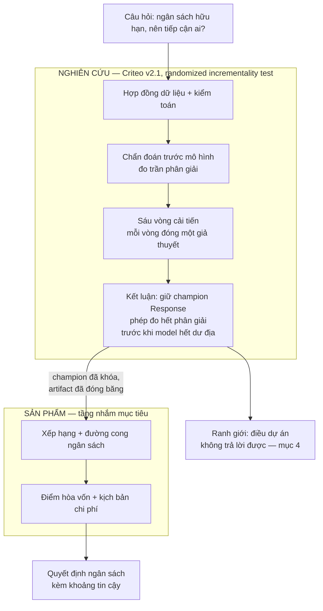
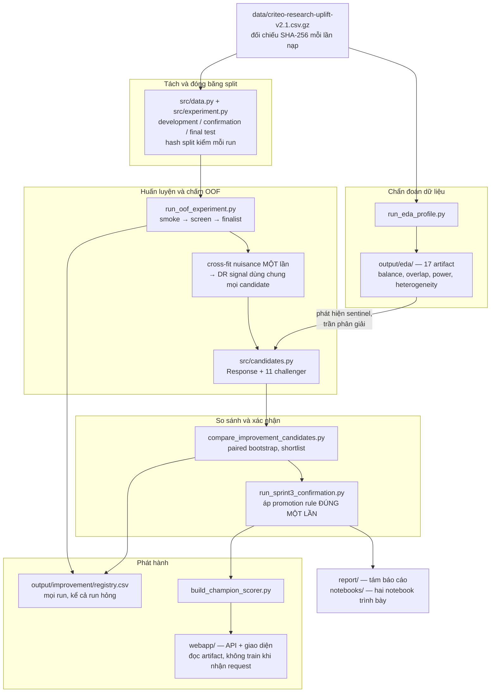
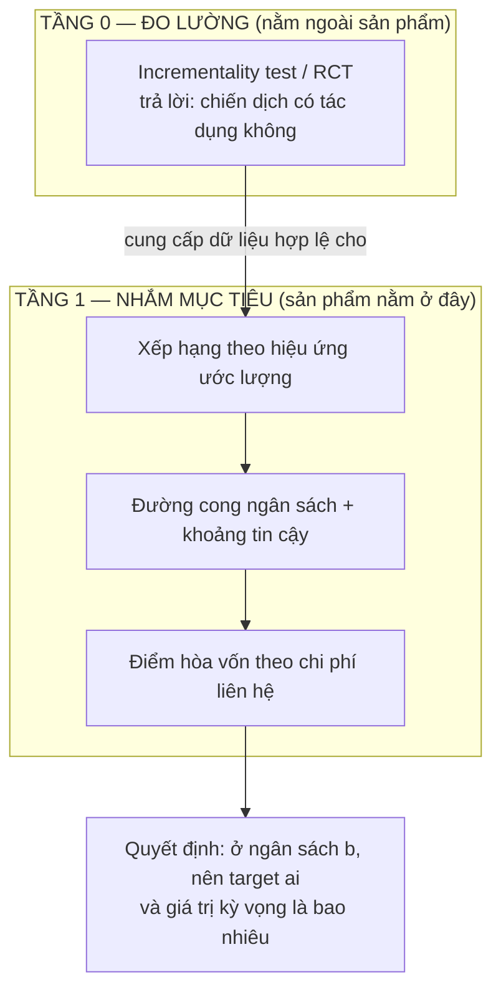
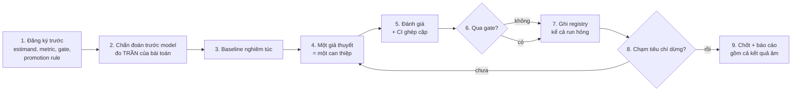

# Flow công việc toàn dự án — từ câu hỏi nhân quả đến sản phẩm hai tầng

- **Ngày:** 24/08/2026
- **Phạm vi:** toàn bộ mạch phát triển của dự án, từ câu hỏi nhân quả tới sản phẩm
- **Quan hệ với tài liệu khác:** đây là **mạch nối**, không phải nguồn số. Mọi con số
  trích ở đây đều thuộc về một báo cáo trong [`../report/`](../report/) và truy được về
  một file trong [`../output/`](../output/)

## 0. Tài liệu này trả lời gì

Repo có tám báo cáo kết quả, sáu method guide và ba tài liệu nghiên cứu. Mỗi cái đúng
trong phạm vi của nó, nhưng không cái nào trả lời câu hỏi: **vì sao dự án đi theo đúng
thứ tự đó, và bước tiếp theo được suy ra từ đâu.**

Đây là câu hỏi mà người đọc lần đầu hỏi trước tiên, và là câu hỏi mà một hội đồng đánh
giá hỏi sau cùng. Tài liệu này trả lời nó bằng một mạch duy nhất: mỗi vòng thí nghiệm
**đóng lại đúng một giả thuyết** về việc vì sao phương pháp nhân quả không thắng baseline
dự đoán, và chính việc đóng lại đó sinh ra vòng kế tiếp. Khi cả ba hướng sửa độc lập đều
đóng, ranh giới lộ ra — và ranh giới đó, chứ không phải một model tốt hơn, là thứ
quyết định việc còn lại đáng làm.

Ba thứ tài liệu này **không** làm: không thay báo cáo kết quả, không phát biểu số mới,
không thay [`REPRODUCTION.md`](REPRODUCTION.md) về mặt lệnh chạy.

## 1. Một câu hỏi, và vì sao nó quyết định mọi thứ phía sau

Câu hỏi kinh doanh: *với ngân sách chỉ đủ tiếp cận một phần khách hàng, nên tiếp cận ai?*

Có hai cách đọc câu hỏi này, và chúng dẫn tới hai đại lượng khác nhau:

| Cách đọc | Đại lượng | Quan sát được không |
|---|---|---|
| "Ai có khả năng mua nhất" | `p(x) = P(Y = 1 \| X = x)` | **Có.** Mỗi khách hàng có một nhãn |
| "Ai mua **nhờ** được tiếp cận" | `τ(x) = E[Y(1) - Y(0) \| X = x]` | **Không.** Mỗi khách hàng chỉ quan sát được một trong hai nhánh |

Toàn bộ độ khó của dự án nằm ở dòng thứ hai. `τ(x)` là hiệu của hai đại lượng không bao
giờ cùng quan sát được trên một cá nhân, nên **không có nhãn để chấm điểm ở mức cá nhân**.
Hệ quả dây chuyền, và mọi quyết định kỹ thuật sau này đều là hệ quả của nó:

1. không dùng được accuracy/RMSE trên `τ` — phải đánh giá ở mức **nhóm**, qua policy value
   hoặc đường cong xếp hạng;
2. cần **randomization** để `τ` được nhận dạng — nên dataset phải là RCT, không phải log
   quan sát;
3. mọi so sánh "model A hơn B" phải kèm **khoảng tin cậy ghép cặp**, vì đại lượng đích đã
   là một hiệu, và hiệu của hai ước lượng nhiễu thì nhiễu hơn nữa.

Ba ràng buộc này được chốt trước khi chạy dòng code mô hình đầu tiên, và chúng giải thích
vì sao repo trông như hiện tại: một protocol đăng ký trước cho mỗi vòng, một registry ghi
cả run thất bại, và một quy tắc "không claim nếu CI chứa 0".

Chi tiết lý thuyết: [`SPRINT_1_THEORY_AND_METHOD_GUIDE.md`](SPRINT_1_THEORY_AND_METHOD_GUIDE.md).

## 2. Sơ đồ toàn cảnh

Ba điều cần đọc ra từ sơ đồ, vì chúng là ba quyết định định hình cả dự án:

- **Chẩn đoán đứng trước mô hình**, không phải sau. Bước A1 dự đoán trước kết quả của cả
  sáu vòng A2. Nếu nó đứng sau, nó đã thành lời biện minh hậu nghiệm.
- **Sản phẩm chỉ đọc artifact đã đóng băng.** Không có đường nào từ sản phẩm ngược về
  nghiên cứu, và sản phẩm không huấn luyện khi nhận request. Nhờ vậy con số trên giao diện
  và con số trong báo cáo không thể trôi khỏi nhau.
- **Ranh giới là một nhánh có tên**, không phải một đoạn cảnh báo cuối trang. Điều dự án
  không trả lời được cũng là kết quả, và nó được phát biểu ở mục 4.

## 2bis. Bản đồ giai đoạn — mỗi giai đoạn nằm ở đâu trong repo

Repo được tổ chức theo **loại artifact** (`src/`, `scripts/`, `output/`, `report/`), vì đó
là bố cục mà công cụ Python và CI cần. Nhưng dự án **phát triển theo giai đoạn**. Bảng này
là chỗ hai trục đó gặp nhau: mỗi dòng là một giai đoạn, đọc ngang là đi hết một giai đoạn
qua mọi thư mục.

| # | Giai đoạn | Câu hỏi của giai đoạn | Protocol | Script chính | Artifact | Báo cáo |
|---:|---|---|---|---|---|---|
| 0 | Chẩn đoán dữ liệu | dữ liệu này cho phép suy luận tới đâu | — | `scripts/run_eda_profile.py` | `output/eda/` | mục 2 của Sprint 1 |
| 1 | Sprint 1 — nền tảng | model nào xếp hạng tốt nhất | — | `scripts/audit_criteo.py`, `scripts/tune_five_models.py`, `scripts/evaluate_selected_five_models.py` | `output/sprint1/`, `output/optimization/` | [SPRINT_1](../report/SPRINT_1_FINAL_REPORT.md) |
| 2 | Sprint 2 — tầng quyết định | biến xếp hạng thành quyết định ngân sách | — | `scripts/run_sprint2_local.py`, `scripts/build_dashboard.py` | `output/sprint2/`, `output/product/` | [SPRINT_2](../report/SPRINT_2_FINAL_REPORT.md) |
| 3 | Sprint 3 — vòng đăng ký trước | metric nào mới là metric quyết định | `configs/sprint3_improvement_protocol.json` | `scripts/run_oof_experiment.py`, `scripts/run_sprint3_confirmation.py` | `output/improvement/`, `output/sprint3/` | [SPRINT_3](../report/SPRINT_3_FINAL_REPORT.md) |
| 4 | Causal Forest | có cần một thuật toán chuyên dụng không | — | `scripts/kaggle_causal_forest_gate.py`, `scripts/evaluate_causal_forest.py` | `output/causal_forest/` | [CAUSAL_FOREST](../report/CAUSAL_FOREST_REPORT.md) |
| 5 | Data optimization | biểu diễn dữ liệu có phải nút thắt | `configs/data_optimization_protocol_v1.json` | `scripts/run_oof_experiment.py`, `scripts/analyze_data_optimization.py` | `output/improvement/data_opt_comparison/` | [DATA_OPTIMIZATION](../report/DATA_OPTIMIZATION_REPORT.md) |
| 6 | Causal foundation | estimator có sai thang không | `configs/causal_foundation_protocol_v1.json` | `scripts/merge_oof_runs.py`, `scripts/analyze_causal_foundation.py` | `output/improvement/causal_foundation_analysis/` | [CAUSAL_FOUNDATION](../report/CAUSAL_FOUNDATION_EXPERIMENT_REPORT.md) |
| 7 | Top-tail v2 | có đang nhìn sai vùng ngân sách không | `configs/top_tail_research_protocol_v2.json` | `scripts/analyze_top_tail_evidence.py` | `output/improvement/top_tail_research_v2/` | [TOP_TAIL_V2](../report/TOP_TAIL_RESEARCH_V2_REPORT.md) |
| 8 | Causal Forest rare-outcome | thuật toán đó có bị đặt sai cấu hình không | `configs/causal_forest_rare_outcome_protocol_v1.json` | `scripts/train_causal_forest.py`, `scripts/evaluate_causal_forest.py` | `output/causal_forest/sprint3_rare_outcome/` | [CF_RARE_OUTCOME](../report/CAUSAL_FOREST_RARE_OUTCOME_REPORT.md) |
| 9 | Sản phẩm | đưa quyết định tới người dùng | — | `scripts/build_champion_scorer.py`, `scripts/serve_webapp.py` | `output/product/webapp/` | mục 9 của Sprint 3 |

Notebook cắt ngang bảng này chứ không thuộc về một dòng nào: `01` trình bày giai đoạn 0,
`02` trình bày giai đoạn 3, `03` và `04` là bản chạy Kaggle của giai đoạn 4 và 8. Chỉ mục
đầy đủ: [`../notebooks/README.md`](../notebooks/README.md).

Ba thư mục còn lại phục vụ **mọi** giai đoạn, nên chúng không nằm trong bảng:
[`../src/`](../src/) là thư viện dùng chung — chỉ mục theo tầng pipeline ở
[`../src/README.md`](../src/README.md); [`../tests/`](../tests/) khóa các bất biến;
[`../docs/`](../docs/) giữ phương pháp.

## 3. Vòng lặp đã chạy

### 3.0 Pipeline kỹ thuật — bản đồ từ file dữ liệu tới artifact

Mục 3.1 trở đi nói về *mạch suy luận*. Mục này nói về *đường đi của dữ liệu*, để hai thứ
không bị lẫn. Lệnh chạy đầy đủ nằm ở [`REPRODUCTION.md`](REPRODUCTION.md); ở đây chỉ là
bản đồ.

Ba ràng buộc kiến trúc đáng chú ý, vì chúng là thứ giữ cho kết quả tái lập được:

| Ràng buộc | Hiện thực ở đâu | Nó ngăn điều gì |
|---|---|---|
| Nuisance cross-fit **một lần**, dùng chung cho mọi candidate | [`../scripts/run_oof_experiment.py`](../scripts/run_oof_experiment.py) | chênh lệch giữa hai model lẫn với chênh lệch giữa hai tín hiệu chấm điểm |
| Hash split đối chiếu trước mỗi run | [`../src/experiment.py`](../src/experiment.py) | hai lần chạy tưởng là so được nhưng thực ra khác dữ liệu |
| Tầng trình bày chỉ **đọc** artifact | [`../webapp/`](../webapp/), notebook 02 | con số trên báo cáo và trên sản phẩm trôi khỏi nhau |

Mũi tên từ khối chẩn đoán sang khối huấn luyện là mũi tên quan trọng nhất trong sơ đồ:
phát hiện sentinel ở bước EDA về sau trở thành vòng cải tiến thứ tư, và trần phân giải đo
ở bước EDA là thứ giải thích kết quả của cả sáu vòng.

### 3.1 Bước 0 — hợp đồng dữ liệu, chốt trước khi nhìn kết quả

Criteo Uplift v2.1: `13.979.592` dòng, 12 feature ẩn danh, treatment `85%`, conversion
`0,2917%`. Chi tiết nguồn gốc và giới hạn: [`data_cards/CRITEO_V2_1.md`](data_cards/CRITEO_V2_1.md).

Bốn điều được chốt ở bước này, và cả bốn về sau đều có lần cứu dự án khỏi một kết luận sai:

| Điều chốt | Nội dung | Nó chặn được gì |
|---|---|---|
| Estimand | hiệu ứng tăng thêm lên `conversion` | ngăn việc âm thầm đổi sang outcome dễ hơn khi kết quả xấu |
| Biến cấm | `visit` và `exposure` là biến **hậu can thiệp**, cấm làm feature | leakage làm model trông giỏi mà không có giá trị nhân quả |
| Ba tập | development `5.591.836` / confirmation `1.397.959` / final test Sprint 1 `2.096.940`, đối chiếu hash mỗi lần chạy | tái sử dụng tập đã nhìn, tức tune vào test |
| Registry | mọi run vào [`../output/improvement/registry.csv`](../output/improvement/registry.csv), **kể cả run hỏng** | báo cáo chỉ những lần chạy đẹp |

Registry hiện có `97` run trên `24` candidate: `44` screen, `23` smoke, `16` finalist,
`9` confirmation, `2` diagnostic, `2` **failed**, `1` released. Hai dòng `failed` là phần
đáng giá nhất của bảng này — chúng là bằng chứng rằng gate tự động thực sự có kích hoạt,
chứ không phải một điều khoản trang trí.

### 3.2 Bước 1 — chẩn đoán đứng trước mô hình, và nó đã dự đoán trước kết quả

Đây là bước quyết định tính mạch lạc của cả dự án. Trước khi fit model đầu tiên, bước
chẩn đoán ([`../scripts/run_eda_profile.py`](../scripts/run_eda_profile.py), trình bày ở
[`../notebooks/01_eda_criteo.ipynb`](../notebooks/01_eda_criteo.ipynb)) đo ba thứ.

**Một — hiệu ứng trung bình có thật và được đo rất chắc.** ATE `0,11519` điểm phần trăm,
CI `[0,10845%; 0,12192%]`, risk ratio `1,594`. Không có gì mơ hồ ở mức trung bình.

**Hai — nhưng nó nhỏ tuyệt đối, và policy làm việc với giá trị tuyệt đối.** `0,3089%` so
với `0,1938%`. Chênh lệch `0,00115` chính là toàn bộ ngân sách tín hiệu mà mọi CATE
learner phải chia nhỏ tiếp theo `x`.

**Ba — trần phân giải.** [`../output/eda/power_analysis.csv`](../output/eda/power_analysis.csv)
cho biết: phát hiện hiệu ứng bằng `1/10` ATE cần `8,97e06` dòng, vừa đủ trong `13,98`
triệu dòng hiện có. Nhưng `1/100` ATE cần `8,97e08`, tức **64 lần** toàn bộ dataset.

Ba con số đó nói trước một điều: dự án sẽ trả lời chắc chắn câu *treatment có tác dụng
không*, và chỉ trả lời được ở độ phân giải thô câu *tác dụng với ai nhiều hơn*. Sáu vòng
cải tiến sau đó là hệ quả của ràng buộc này, không phải của việc chọn sai model.

Bước chẩn đoán còn đo một thứ nữa, và nó là **cơ chế** giải thích mọi kết quả về sau:
hiệu ứng gần như tỉ lệ thuận với rủi ro nền, `τ(x) ≈ 0,53 · p₀(x)`. Trên 26 pattern
sentinel **rời nhau**, Pearson `0,769` và Spearman `0,883`. Quyết định hơn cả hai con số
đó: Cochran `Q` giảm từ `861` trên thang cộng xuống `150` trên thang nhân, tỷ lệ `5,7`
lần — tức phần lớn tính không đồng nhất biến mất khi đổi thang.

Nói cách khác: hiệu ứng *có* thay đổi theo `x`, nhưng chủ yếu theo đúng cách mà `p₀(x)`
thay đổi. Mà `p₀` chính là thứ baseline Response ước lượng trực tiếp và ước lượng tốt.
**Đây là lý do Response khó bị đánh bại, và nó được đo trên dữ liệu thô, trước mọi model.**

### 3.3 Sáu vòng — mỗi vòng đóng một giả thuyết

Mạch phát triển không phải "thử thêm model cho tới khi thắng". Nó là một chuỗi loại trừ:
mỗi vòng nhận một giả thuyết cụ thể về *vì sao* nhân quả chưa thắng, can thiệp đúng vào
giả thuyết đó, và đóng nó lại bằng bằng chứng. Thứ tự dưới đây vừa là thứ tự **thời gian**
vừa là thứ tự **suy luận** — mỗi câu hỏi mới đến từ vòng ngay trước nó.

```mermaid
flowchart LR
    H0["Vì sao CATE learner<br/>không thắng Response?"]
    H1["H1: chọn model<br/>chưa đủ chặt"]
    H2["H2: metric sai<br/>trọng tâm"]
    H3["H3: cần thuật toán<br/>chuyên dụng"]
    H4["H4: biểu diễn<br/>dữ liệu thiếu"]
    H5["H5: estimator<br/>sai thang"]
    H6["H6: sai vùng<br/>ngân sách"]
    H7["H7: thuật toán đó<br/>bị đặt sai cấu hình"]
    R["Còn lại: ràng buộc<br/>nằm ở PHÉP ĐO"]

    H0 --> H1 -->|"Sprint 1-2 · 29-31/07"| H2
    H2 -->|"Sprint 3 · 05/08"| H3
    H3 -->|"causal forest · 06/08"| H4
    H4 -->|"data optimization · 09/08"| H5
    H5 -->|"causal foundation · 09/08"| H6
    H6 -->|"top-tail v2 · 09/08"| H7
    H7 -->|"cf rare-outcome · 14/08"| R
```

Bảng dưới là cùng một mạch, kèm bằng chứng đóng của từng bước:

| # | Ngày | Giả thuyết được kiểm | Can thiệp | Kết quả | Điều nó đóng lại | Câu hỏi nó mở ra |
|---|---|---|---|---|---|---|
| 1 | 29/07 | Sprint 1 — chọn model chưa đủ chặt | 5 model, gate `median ΔQini ≥ 0,005` trên 3 seed validation | 2 candidate thắng validation **đổi dấu** trên test | gate theo point estimate trên một pool là không đủ | vậy chọn model bằng gì |
| 2 | 31/07 | Sprint 2 — cần tầng quyết định và CI | policy value DR, 500 paired bootstrap, confirmation mới | X-Renormalized cao hơn nhưng CI chứa 0; giữ Response theo hợp đồng | point estimate cao hơn không phải bằng chứng | metric chính có đang đo đúng thứ cần không |
| 3 | 05/08 | Sprint 3 — metric sai trọng tâm | đổi metric chính Qini sang `policy_area_dr`, cross-fitting OOF, hai fold seed, promotion rule bốn điều kiện | 12 candidate, không ai promote. **Qini và metric chính xếp ngược nhau** | Qini không phải metric quyết định cho bài toán ngân sách | có phải cần một thuật toán chuyên dụng ngoài họ meta-learner |
| 4 | 06/08 | Causal Forest — thuật toán chuyên dụng | `CausalForestDML` ba mốc dữ liệu 20/30/50%, chấm trên cùng holdout Sprint 1 | `policy_area_dr` hạng `1/6`, Qini hạng `3/6`, CI chứa 0 | thuật toán chuyên dụng cũng không tách được khỏi baseline | có phải biểu diễn dữ liệu thiếu cấu trúc |
| 5 | 09/08 | Data optimization — biểu diễn thiếu cấu trúc | đưa point mass và sentinel phát hiện trong EDA thành feature tường minh | Response-Sentinel qua screen, **trượt gate ổn định ở full** | biểu diễn dữ liệu không phải nút thắt | có phải estimator sai thang |
| 6 | 09/08 | Causal foundation — estimator sai thang | DINA học trên log-odds, Anchored R giữ neo tiên lượng, Pattern R gộp một phần theo 53 pattern | không candidate nào thắng ở cả hai seed; đổi dấu theo seed | đúng thang chưa đủ để khử phương sai xếp hạng | có phải đang nhìn sai vùng ngân sách |
| 7 | 09/08 | Top-tail v2 — sai vùng ngân sách | audit riêng budget `1%` và `2%`, familywise simultaneous band trên họ 20 ô | `16/16` point delta dương, **`0/16`** cận dưới vượt 0 | tín hiệu ở đuôi là giả thuyết, không phải bằng chứng | có phải Causal Forest chỉ bị đặt sai cấu hình cho outcome hiếm |
| 8 | 14/08 | Causal Forest rare-outcome | `min_samples_leaf` từ `500` lên `10.000`, chạy trên split Sprint 2/3, chấm bằng DR signal đóng băng | hạng `1/10` theo metric chính nhưng CI chứa 0, tức hòa | cấu hình cho outcome hiếm không phải nút thắt | *(không còn giả thuyết phía model)* |

Tám dòng: hai dòng đầu là nền tảng, sáu dòng sau là sáu vòng cải tiến. Sau
dòng cuối, **không còn giả thuyết nào phía model chưa bị kiểm**. Ba hướng sửa độc lập —
biểu diễn dữ liệu, estimator, thuật toán — đều đóng. Đó là lúc kết luận đổi từ "chưa tìm
được model tốt hơn" thành một phát biểu mạnh hơn và kiểm chứng được: **phép đo hết độ
phân giải trước khi model hết dư địa.**

Bằng chứng số cho phát biểu đó: trên confirmation, độ phân giải của `policy_area_dr` là
khoảng `±1,74e-05`, trong khi chênh lệch giữa các model hàng đầu nằm ở bậc `1e-06` — nhỏ
hơn một bậc độ lớn so với thứ đo được.

### 3.4 Hai lần điều chỉnh metric, và cách làm điều đó mà không thành p-hacking

Dự án đổi metric chính **một lần** và sửa cách phát biểu về độ nhạy **một lần**. Cả hai
đều là thời điểm dễ mất tính chính trực nhất, nên cách xử lý được ghi lại đầy đủ.

**Lần 1 — Qini sang `policy_area_dr` ở Sprint 3.** Lý do không phải "Qini cho kết quả
xấu", mà là Qini tích hợp trên toàn dải `0-100%` trong khi quyết định thật chỉ dùng dải
`1-30%`. Ba điều làm cho việc đổi này hợp lệ:

1. đổi **trước** khi chạy, ghi trong [`../configs/sprint3_improvement_protocol.json`](../configs/sprint3_improvement_protocol.json);
2. Qini **vẫn được báo cáo** làm metric phụ, không bị bỏ đi;
3. khi hai metric xếp ngược nhau, kết luận theo metric đã đăng ký trước, và **bất đồng đó
   được báo cáo như một phát hiện** chứ không bị giấu.

Điểm 3 là chỗ giao thức chứng minh giá trị của nó: trên confirmation, bốn model có Qini
cao hơn Response nhưng `policy_area_dr` thấp hơn. Nếu Qini vẫn là metric chính, kết luận
của cả dự án đã đảo chiều. Việc đăng ký trước là thứ duy nhất ngăn được lựa chọn hậu
nghiệm ở đây.

**Lần 2 — bỏ cách phát biểu "cần 2.123 lần toàn bộ Criteo", ngày 14/08/2026.** Con số đó
dùng công thức `n · (nửa CI / Δ)²`, tức **chia cho một point estimate mà chính nó không
phân biệt được với 0**. Cùng công thức, cùng dữ liệu, chỉ đổi tín hiệu chấm điểm từ IPW
sang DR thì ra `1,8×` thay vì `2.123×`, chênh gần `7.800` lần. Cách sửa: phát biểu bằng
**độ rộng CI**, không bằng tỷ lệ dữ liệu cần thêm. Đính chính được ghi tại chỗ trong
[`../report/README.md`](../report/README.md) thay vì sửa lặng lẽ.

Vòng cuối còn phát hiện thêm một điều đắt hơn cả hai lần trên: **thứ hạng theo point
estimate không ổn định khi đổi tín hiệu chấm điểm.** Chấm lại cùng một bộ điểm, trên cùng
những dòng dữ liệu, chỉ đổi IPW sang DR, làm Response tụt từ hạng 2 xuống hạng 4 trên sáu
model, dù mọi paired CI trong nhóm đầu đều chứa 0. Bài học vận hành: **cố định và ghi rõ
tín hiệu chấm điểm trước khi so sánh bất cứ thứ gì**, ngang hàng với việc cố định metric.

### 3.5 Xử lý dữ liệu được đối xử như một can thiệp, không phải bước chuẩn bị

Trong flow này, xử lý dữ liệu không nằm ở đầu như một bước tiền xử lý mặc định. Nó là
**vòng 4**, một can thiệp có giả thuyết riêng và gate riêng.

Lý do: EDA phát hiện các point mass là **sentinel value** chứ không phải mức thật của
biến. Nếu chỉ coi đó là chuyện làm sạch dữ liệu, ta sẽ âm thầm impute hoặc bỏ, và mất
thông tin. Coi nó là giả thuyết — *biểu diễn tường minh cấu trúc sentinel sẽ giải phóng
tín hiệu nhân quả* — thì nó được kiểm bằng đúng bộ gate như mọi model khác, và kết quả là
một câu trả lời dùng được: qua screen, trượt ổn định ở full.

Nguyên tắc rút ra, áp dụng cho mọi vòng sau: **mọi phép biến đổi dữ liệu làm đổi kết quả
đều là một can thiệp và phải qua gate.** Chỉ những phép không đổi kết quả — ép kiểu, đối
chiếu checksum — mới thuộc về bước chuẩn bị.

### 3.6 Khi nào dừng một module — tiêu chí dừng đo được

"Lặp đến khi tốt nhất" cần một định nghĩa, nếu không nó thành lặp vô hạn. Dự án dùng ba
điều kiện dừng, và chỉ cần **một** điều kiện đúng là dừng:

| Điều kiện dừng | Cách đo | Trạng thái hiện tại |
|---|---|---|
| **Hết phân giải** — nửa độ rộng CI lớn hơn mọi cải thiện còn hợp lý | so nửa CI với chênh lệch giữa các model hàng đầu | **Đã chạm.** `±1,74e-05` so với bậc `1e-06` |
| **Hết giả thuyết** — mọi giả thuyết đã đăng ký về nguyên nhân đều bị đóng | bảng ở mục 3.3 | **Đã chạm.** 7/7 đóng |
| **Hết giá trị biên** — N vòng liên tiếp không candidate nào qua gate | registry | **Đã chạm.** 6 vòng, 0 promote |

Cả ba cùng đúng. Đó là lý do hướng nghiên cứu **đóng lại có căn cứ** chứ không phải bị bỏ
dở. Và
quan trọng cho mạch tài liệu này: điều kiện dừng thứ nhất chỉ thẳng ra thứ còn thiếu —
không phải một model tốt hơn, mà là **một phép đo có độ phân giải cao hơn**.

## 4. Ranh giới — điều dự án này không trả lời được

Điều kiện dừng ở mục 3.6 không nói "hết cách". Nó nói chính xác cái gì còn thiếu. Viết
thành bốn điều kiện mà một dataset phải có để đẩy câu hỏi đi tiếp:

| Điều kiện | Vì sao cần | Criteo v2.1 |
|---|---|---|
| **(a)** treatment được randomize | để `τ` được nhận dạng mà không cần giả định về confounding | **Có** |
| **(b)** outcome tiền tệ | để xếp hạng theo *giá trị* tăng thêm, không chỉ theo *xác suất* tăng thêm | **Không.** Chỉ có nhãn nhị phân |
| **(c)** đủ số sự kiện | để CI hẹp hơn chênh lệch giữa các model | **Không đủ.** `1.625` conversion ở nhánh control của development pool |
| **(d)** feature diễn giải được | để nói được *ai* được chọn, không chỉ *bao nhiêu người* | **Không.** 12 biến ẩn danh |

Criteo đạt đúng một trong bốn. Đó là ranh giới thật của dự án, và nó được phát biểu ở đây
thay vì để người đọc tự phát hiện.

**Vì sao không mở thêm dataset để lấp ba điều kiện còn lại.** Vì lấp bằng một dataset
*khác* thì không lấp được gì. Muốn xếp hạng theo giá trị tăng thêm, `τ(x)` và `v(x)` phải
được ước lượng trên **cùng một quần thể**; hai đại lượng đến từ hai quần thể khác nhau thì
tích của chúng không phải đại lượng của quần thể nào, và còn dính surrogate paradox — ngay
cả khi treatment được randomize, confounding giữa đại lượng thay thế ngắn hạn và outcome
dài hạn có thể làm kết luận sai **dấu**.

Luật này được đăng ký từ trước, không phải dựng lên sau khi gặp câu hỏi:
[`../planning/RESEARCH_LANDSCAPE_2026.md`](../planning/RESEARCH_LANDSCAPE_2026.md) mục 5 —
*không ghép dataset để tạo ra một estimand không quan sát được* — và mục 5 của
`MARKET_AND_VALUE_RESEARCH.md`: *chỉ thêm dataset khi nó bổ sung một **chế độ tín hiệu**
chưa có.*

**Điều gì sẽ làm ranh giới này dịch chuyển.** Một dataset **duy nhất** thỏa đồng thời cả
bốn điều kiện. Khi đó câu hỏi giá trị tăng thêm mở được ngay trên chính dataset đó, và
không phải ghép gì cả. Ứng viên gần nhất hiện biết là các dataset uplift có tỷ lệ sự kiện
cao hơn — Lenta có `17.555` sự kiện ở nhánh control, gấp `4,3` lần Criteo — nhưng chúng
phục vụ điều kiện (c), không phục vụ (b).

Cho tới khi có dataset đó, phát biểu đúng của dự án là phát biểu **có điều kiện**: trên
chế độ outcome hiếm của Criteo, xếp hạng theo rủi ro nền không bị bất kỳ phương pháp nhân
quả nào tách khỏi. Không suy rộng ra ngoài chế độ đó.

## 5. Sản phẩm — hai tầng, và ranh giới giữa chúng

Yêu cầu đã ghi từ trước và giữ nguyên: sản phẩm phải nói rõ nó là tầng **nhắm mục tiêu**,
đặt **sau** tầng **đo lường**, và **không thay thế** incrementality test. Đây không phải
khiêm tốn hình thức — nhầm hai tầng này là cách một tổ chức tự thuyết phục mình rằng chiến
dịch có hiệu quả bằng chính model dùng để phân phối chiến dịch đó.

### 5.1 Điều sản phẩm được phép nói và không được phép nói

Bảng này là công cụ kiểm tra khi viết nhãn giao diện, tên cột artifact và tên biến:

| Được phép | Không được phép | Vì sao |
|---|---|---|
| "Nhóm này có hiệu ứng ước lượng cao nhất trên dữ liệu thí nghiệm Criteo" | "Nhóm này sẽ mang lại nhiều doanh thu tăng thêm nhất" | Criteo không có outcome tiền tệ |
| "Ở ngân sách 10%, giá trị policy ước lượng là ... với CI ..." | Một con số điểm không kèm CI | Luật đã đăng ký của repo |
| "Chênh lệch giữa hai model không phân biệt được với 0" | "Hai model tương đương" | Không phân biệt được khác với bằng nhau |
| "Giá trị và chi phí là input kịch bản của người dùng" | Trình bày chúng như doanh thu quan sát được | Mọi con số tiền trong sản phẩm là conversion-equivalent |
| "Đây là tầng nhắm mục tiêu, đặt sau tầng đo lường" | "Công cụ này đo hiệu quả chiến dịch" | Nhầm tầng |

Kiểm tra ngôn ngữ nên được tự động hóa như repo đã làm với ba cụm từ vượt bằng chứng trong
test tài liệu.

### 5.2 Trạng thái sản phẩm

[`../webapp/`](../webapp/) — API FastAPI và giao diện SPA không CDN, `30/30` acceptance
trình duyệt. [`../output/product/`](../output/product/) — dashboard HTML self-contained,
`12/12` acceptance.

Cả hai **chỉ đọc artifact đã phát hành** và không huấn luyện khi nhận request. Nhờ vậy con
số trên sản phẩm và con số trong báo cáo không thể trôi khỏi nhau — chúng đọc chung một
file.

## 6. Vòng lặp tổng — định nghĩa "module tốt nhất"

Cả hai bài toán dùng chung một vòng lặp. Đây là phần dùng lại được cho bất kỳ module nào
mở sau này.

Bốn điều làm vòng lặp này khác một vòng lặp thử-và-sai thông thường:

1. **Bước 2 đứng trước bước 3.** Biết trần trước khi biết kết quả là thứ biến một kết quả
   âm từ "thất bại" thành "xác nhận một dự đoán".
2. **Bước 4 nhận đúng một giả thuyết.** Đổi nhiều thứ cùng lúc thì không quy được kết quả
   về nguyên nhân nào, và vòng sau mất điểm tựa.
3. **Bước 7 nằm trên cả hai nhánh.** Run hỏng cũng vào registry. Nếu chỉ ghi run đẹp thì
   tỷ lệ thành công trong báo cáo là một con số vô nghĩa.
4. **Bước 8 có tiêu chí đo được**, không phải cảm giác đã đủ.

**"Tốt nhất" nghĩa là gì.** Không phải điểm số cao nhất có thể — mà là trạng thái mà
**mọi cải thiện tiếp theo đều nhỏ hơn thứ phép đo phân biệt được**. Phát biểu như vậy có
ba hệ quả dùng được:

- nó **kiểm chứng được**: so nửa độ rộng CI với chênh lệch giữa các model;
- nó **dừng được**: không cần tranh luận đã thử đủ chưa;
- nó **chỉ ra bước tiếp theo**: khi bị chặn bởi phép đo, việc cần làm là cải thiện thiết
  kế đo lường, không phải thêm model thứ mười ba.

Bài toán A đã đi trọn vòng này và dừng ở trạng thái đó. Bài toán B chưa bắt đầu bước 1.

## 7. Trạng thái và việc còn lại

| Giai đoạn | Trạng thái | Nguồn |
|---|---|---|
| 0 — chẩn đoán dữ liệu | **Xong.** 17 artifact, và nó dự đoán trước kết quả sáu vòng sau | [`../output/eda/`](../output/eda/) |
| 1 — nền tảng model và đánh giá | **Xong** | [SPRINT_1](../report/SPRINT_1_FINAL_REPORT.md) |
| 2 — tầng quyết định và CI | **Xong** | [SPRINT_2](../report/SPRINT_2_FINAL_REPORT.md) |
| 3 — vòng đăng ký trước, đổi metric chính | **Xong** | [SPRINT_3](../report/SPRINT_3_FINAL_REPORT.md) |
| 4 — Causal Forest ba mốc | **Xong** | [CAUSAL_FOREST](../report/CAUSAL_FOREST_REPORT.md) |
| 5, 6, 7 — ba vòng đóng giả thuyết còn lại | **Xong** | Data optimization, Causal foundation, Top-tail v2 |
| 8 — Causal Forest rare-outcome | **Xong** | [CF_RARE_OUTCOME](../report/CAUSAL_FOREST_RARE_OUTCOME_REPORT.md) |
| Kết luận và tiêu chí dừng | **Xong.** Cả ba tiêu chí đều chạm | Mục 3.6 |
| 9 — sản phẩm, tầng nhắm mục tiêu | **Chạy được**, `30/30` và `12/12` acceptance. Đã qua vòng thiết kế đầu tiên | Mục 5.2 |

Một hạng mục còn mở, và nó nằm ở phía sản phẩm chứ không phải phía nghiên cứu — đúng như
tiêu chí dừng ở mục 3.6 dự đoán:

**Sản phẩm chưa qua một vòng thiết kế nào.** Nó vượt acceptance, nghĩa là **đúng chức
năng**, không có nghĩa là **dễ hiểu**. Đây là chỗ có tỷ lệ giá trị trên chi phí cao nhất
còn lại của dự án: nghiên cứu đã chạm cả ba tiêu chí dừng, nên công sức tiếp theo bỏ vào
model sẽ không đổi được kết luận, còn công sức bỏ vào việc **làm rõ kết luận đó cho người
đọc** thì đổi được.

Điều **không** làm, ghi lại để lần sau không phải tranh luận: không mở thêm dataset để lấp
ba điều kiện thiếu ở mục 4 — lý do là lý do nhận dạng, không phải lý do công sức; không
thêm meta-learner thứ mười ba; không tinh chỉnh hyperparameter sau khi đã nhìn kết quả.
