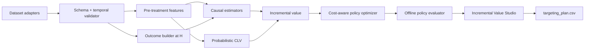

# 03 — Kiến trúc Kỹ thuật (Technical Architecture)

## Kiến trúc logic



## Hợp đồng dữ liệu (Data Contract)

```text
customers:
  customer_id
  assignment_date
  treatment
  treatment_cost
  pre_treatment_features...

transactions:
  customer_id
  transaction_date
  gross_revenue
  margin

campaign:
  treatment_name
  assignment_probability
  value_horizon_days
```

Validation:

- unique `customer_id` trong assignment table;
- `0 < assignment_probability < 1`;
- mọi feature timestamp `< assignment_date`;
- outcome window bắt đầu sau assignment;
- treatment/control đều có sample;
- không customer overlap giữa train/validation/test;
- temporal cutoff được persist trong config.

## Cấu trúc repository đích

```text
src/
  data/
    contracts.py
    temporal.py
    criteo.py
    online_retail.py
    hillstrom.py
    semisynthetic.py
  causal/
    learners.py
    outcomes.py
    evaluation.py
  clv/
    rfm.py
    bgnbd.py
    gamma_gamma.py
    validation.py
  value/
    estimands.py
    incremental_value.py
  policy/
    baselines.py
    optimizer.py
    off_policy_evaluation.py
  artifacts/
    registry.py
app/
  streamlit_app.py
configs/
tests/
reports/
```

Không refactor causal trước khi tag `causal-v0.1`. Sau khi freeze, di chuyển logic theo từng
vertical slice có test, không đổi toàn bộ namespace trong một commit.

## Trách nhiệm các module (Module Responsibilities)

### `src/data`

- load/cache dataset;
- schema validation;
- temporal splits;
- pre-treatment feature generation;
- outcome construction theo horizon;
- semi-synthetic DGP.

### `src/clv`

- RFM summary;
- BG/NBD fit/predict;
- Gamma-Gamma fit/predict;
- rolling temporal validation;
- model persistence;
- output `customer_clv_predictions`.

### `src/causal`

- shared CATE estimator interface;
- continuous/binary outcome support;
- cross-fitting;
- value uplift/calibration;
- bootstrap/paired comparison.

### `src/value`

- định nghĩa iCV/projected iCLV;
- discount/margin/cost transforms;
- sensitivity scenarios;
- không tự fit model.

### `src/policy`

- baselines;
- budget/cost constraints;
- doubly robust policy value;
- threshold/frontier calculation;
- target/hold/exclude action.

### `src/artifacts`

- model/config/metric metadata;
- load versioned artifact;
- trace UI number về source;
- refuse mismatched schema/model version.

## Hợp đồng artifact/kết quả chạy (Artifact Contract)

Mỗi run chính thức sinh:

```text
artifacts/<run_id>/
  config.yaml
  data_manifest.json
  model_registry.json
  metrics.json
  customer_scores.parquet
  policy_curve.parquet
  figures/
```

`run_id` chứa date + git SHA hoặc immutable ID. Không ghi đè final result mà không lưu provenance.

`data_manifest.json` bắt buộc có source URL/DOI, license, retrieval date, SHA-256, raw row count,
cleaning rule ID, schema hash và outcome/currency definition. Đây là guard rail cho Criteo version drift
và cho phép recruiter tái lập đúng artifact.

## Môi trường phát triển (Environment)

Chuyển từ một `requirements.txt` phẳng sang `pyproject.toml` với optional groups:

```text
.[causal]
.[clv]
.[bayesian]
.[app]
.[dev]
```

Pin Python 3.12 cho môi trường đã kiểm chứng. Tạo lock file. `lifetimes` chỉ là fast baseline vì
đã ngừng bảo trì; PyMC-Marketing là maintained challenger.

## Ngăn xếp sản phẩm (Product Stack)

P0:

- Streamlit UI;
- pure Python domain layer;
- Pydantic data/artifact contracts;
- precomputed demo artifacts;
- Docker;
- GitHub Actions;
- structured run/app logs + health check;
- CSV export.

P1:

- batch scoring CLI;
- lightweight FastAPI endpoint (promote lên P0 chỉ khi core dashboard xong đúng Day 22);
- object storage/model registry.

Không làm React/Kubernetes nếu app chưa pass product acceptance test.

API tối thiểu nếu mở AI Engineer track chỉ phục vụ artifact đã precompute, không retrain model trong
request path:

```text
GET  /health
POST /v1/scenarios/evaluate     # budget, cost, margin, horizon -> policy summary
GET  /v1/customers/export       # policy/run_id/filter -> CSV/Parquet export
GET  /v1/runs/{run_id}/metadata # data/model/source provenance
```

Mỗi endpoint có Pydantic schema, contract test, deterministic sample response và không nhận PII.

## Chiến lược kiểm thử (Test Strategy)

### Kiểm thử đơn vị (Unit Tests)

- temporal leakage guards;
- RFM calculations;
- probability/CLV sanity;
- policy threshold/cost;
- semi-synthetic truth;
- metric edge cases.

### Kiểm thử tích hợp (Integration Tests)

- Online Retail raw → CLV artifact;
- Hillstrom raw → policy curve;
- semi-synthetic raw → score → optimizer → evaluator;
- artifact → app.

### Kiểm thử hồi quy (Regression Tests)

- benchmark counts/summary trong tolerance;
- expected schema;
- fixed-seed metrics;
- dashboard totals trace về artifact.

### Kiểm thử khởi động nhanh (Smoke Tests)

- fresh environment;
- `pytest`;
- sample pipeline;
- app boot;
- Docker boot.

## Mục tiêu hiệu năng (Performance Targets)

- parquet load nhanh hơn xlsx ít nhất 5 lần;
- sample end-to-end pipeline dưới 10 phút;
- app sample mode load dưới 5 giây;
- 100k precomputed customers filter/export tương tác được;
- CI suite dưới 10 phút bằng fixtures/sample data.

Các target này phải được đo từ release candidate; nếu không đạt, báo metric quan sát được
thay vì giữ target như kết quả.
