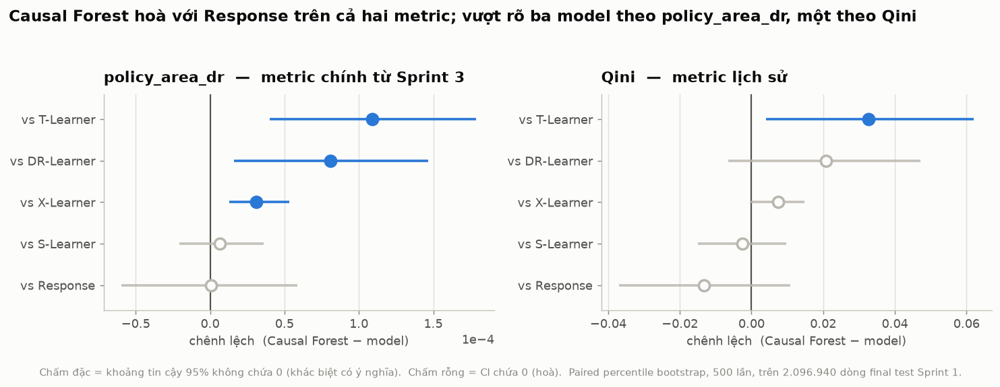
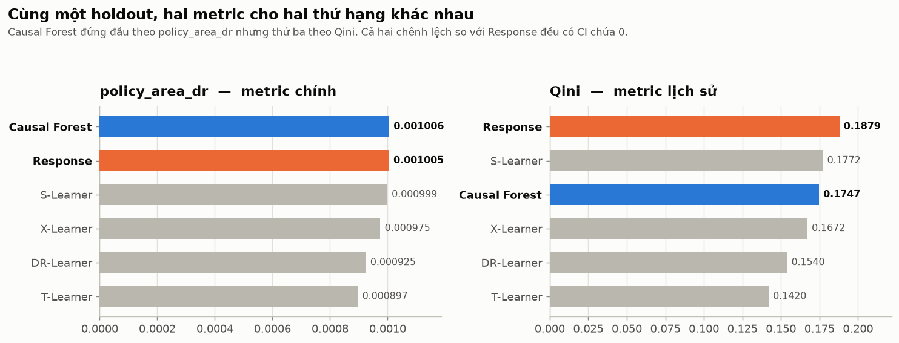
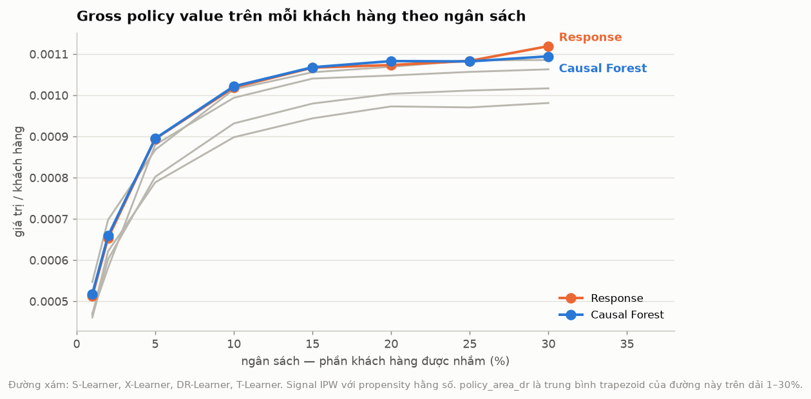
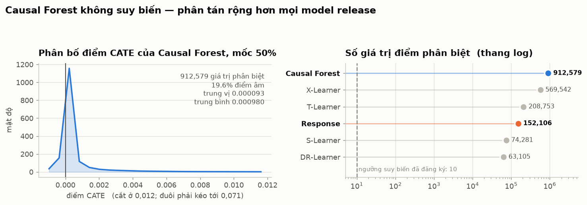
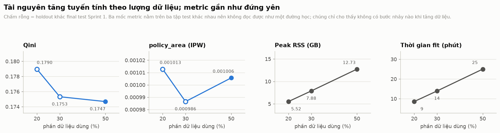

# Causal Forest — báo cáo kết quả

- **Ngày:** 06/08/2026
- **Nguồn số:** `output/causal_forest/preflight_0p2/`, `output/causal_forest/preflight_0p3/`,
  `output/causal_forest/preflight_0p5/`, `output/causal_forest/release/`,
  `output/causal_forest/analysis/`
- **Notebook:** [`03_causal_forest.ipynb`](../notebooks/03_causal_forest.ipynb)

> **Cập nhật 14/08/2026.** Cấu hình trong báo cáo này dùng `min_samples_leaf=500`, chỉ cho
> khoảng `0,145` sự kiện control mỗi lá — không phù hợp với outcome hiếm. Một vòng riêng đã
> chạy lại với `min_samples_leaf=10000` trên split Sprint 2/3 và vẫn hòa với Response:
> [`CAUSAL_FOREST_RARE_OUTCOME_REPORT.md`](CAUSAL_FOREST_RARE_OUTCOME_REPORT.md). Vòng đó cũng
> cho thấy chấm lại chính artifact của báo cáo này bằng DR signal thay vì IPW làm chênh lệch
> đo được đổi **69 lần** — xem mục 5 của báo cáo mới trước khi trích số ở đây.

Causal Forest là thuật toán chuyên dụng duy nhất trong dự án — nó sửa thẳng tiêu chí chia
nhánh của cây thay vì ghép các model thông thường như bốn meta-learner. Báo cáo này trình
bày kết quả của nó trên ba mốc dữ liệu và so sánh với năm model còn lại trên cùng holdout.

## 1. Kết quả trong một câu

Trên final test Sprint 1, Causal Forest **không phân biệt được với Response** trên cả hai
metric, và vượt rõ ba trong năm model release theo metric chính.

| Model | `policy_area_dr` | Qini |
|---|---:|---:|
| **Causal Forest** | **0,001006** — hạng 1/6 | 0,174678 — hạng 3/6 |
| Response (champion) | 0,001005 — hạng 2/6 | **0,187886** — hạng 1/6 |
| S-Learner | 0,000999 — hạng 3/6 | 0,177204 — hạng 2/6 |
| X-Learner | 0,000975 — hạng 4/6 | 0,167168 — hạng 4/6 |
| DR-Learner | 0,000925 — hạng 5/6 | 0,153967 — hạng 5/6 |
| T-Learner | 0,000897 — hạng 6/6 | 0,142021 — hạng 6/6 |
| Chênh lệch CF - Response | `+4,96e-07` | `-0,013208` |
| CI 95% paired bootstrap | `[-0,000060; 0,000058]` | `[-0,036989; 0,010740]` |
| CI chứa 0 | **có** | **có** |

Cả hai chênh lệch đều không có ý nghĩa thống kê. `probability_positive = 0,504` trên
metric chính — gần đúng một phép tung đồng xu.

**Champion không đổi.** Hoà không phải thắng, và promotion rule yêu cầu lower bound của
CI lớn hơn 0.

## 2. Bằng chứng so sánh cặp

Paired percentile bootstrap 500 lần trên cùng 2.096.940 dòng, mọi model dùng chung
bootstrap weights nên pairing được giữ đúng.

| So với | Δ policy_area_dr | CI 95% | Δ Qini | CI 95% |
|---|---:|---|---:|---|
| Response | `+4,96e-07` | `[-6,0e-05; 5,8e-05]` | `-0,013208` | `[-0,0370; 0,0107]` |
| S-Learner | `+6,75e-06` | `[-2,1e-05; 3,6e-05]` | `-0,002526` | `[-0,0150; 0,0097]` |
| X-Learner | `+3,09e-05` | `[1,3e-05; 5,3e-05]` | `+0,007510` | `[-0,0005; 0,0148]` |
| DR-Learner | `+8,10e-05` | `[1,6e-05; 1,5e-04]` | `+0,020711` | `[-0,0064; 0,0472]` |
| T-Learner | `+1,09e-04` | `[4,0e-05; 1,8e-04]` | `+0,032657` | `[0,0041; 0,0620]` |

Theo `policy_area_dr`: vượt rõ X, DR, T; hòa với Response và S.
Theo Qini: chỉ vượt rõ T; hòa với bốn model còn lại.

## 3. Hai metric xếp hạng khác nhau

Cùng một holdout, cùng một bộ điểm, hai thứ hạng khác nhau. Hiện tượng này đã gặp ở
Sprint 3 với Ensemble-QAgg và S-Under7, và là lý do thứ tự metric được đăng ký **trước**
khi chạy.

`policy_area_dr` là metric chính từ Sprint 3. Nó đo trung bình trapezoid của DR gross
policy value trên dải ngân sách 1–30% — tức là đo giá trị thu được ở những mức ngân sách
thực sự dùng. Qini tích hợp trên toàn dải 0–100%, gồm cả những mức ngân sách không ai
triển khai.

Không được trích một trong hai con số rời khỏi ngữ cảnh này.

Đường ngân sách cho thấy vì sao: Causal Forest bám sát Response tới mốc 25%, rồi Response
vượt lên ở mốc 30%. Phần Qini thưởng thêm nằm ngoài dải mà `policy_area_dr` đo.

## 4. Model không suy biến

Đây là kiểm tra bắt buộc, vì `min_samples_leaf=500` với conversion rate `0,002917` cho
trung bình chỉ **1,4 conversion mỗi lá**, rồi honest splitting chia đôi tiếp giữa hai
nhánh. Cấu hình đó hoàn toàn có thể sinh ra điểm gần như hằng số.

Kết quả: **912.579 giá trị phân biệt** trên 2.096.940 dòng, rộng hơn mọi model release.
Ngưỡng suy biến đã đăng ký ở Sprint 3 là 10 giá trị phân biệt; kết quả cách ngưỡng đó năm
bậc độ lớn.

| | Giá trị phân biệt | Điểm âm | Trung bình | Độ lệch chuẩn |
|---|---:|---:|---:|---:|
| Causal Forest | 912.579 | 19,6% | 0,000980 | 0,004482 |
| Response | 152.106 | 0,0% | 0,002859 | 0,026244 |
| X-Learner | 569.542 | 24,2% | 0,000616 | 0,002308 |
| T-Learner | 208.753 | 54,0% | 0,000994 | 0,010351 |
| S-Learner | 74.281 | 0,4% | 0,000863 | 0,005098 |
| DR-Learner | 63.105 | 0,7% | 0,000971 | 0,011949 |

Trung bình điểm `0,000980` nằm gần ATE quan sát `0,001152`, tức mức hiệu chuẩn tổng thể
hợp lý.

Response có **0% điểm âm** vì nó xếp hạng theo xác suất chuyển đổi, vốn không âm. Điều
này nhắc lại một giới hạn đã ghi từ Sprint 1: Response đứng đầu bảng xếp hạng nhưng không
phải CATE estimator đầy đủ — nó không biểu diễn được hiệu ứng âm.

Điểm âm là **dự đoán phụ thuộc model**, không phải một tầng quan sát được.

## 5. Ba mốc dữ liệu và tài nguyên

| Mốc | Train | Holdout | So được với release | Peak RSS | RAM | Fit | Qini |
|---|---:|---:|:---:|---:|---:|---:|---:|
| 20% | 1.957.143 | 838.776 | không | 5,52 GB | 17,6% | 8,5 phút | 0,178964 |
| 30% | 2.935.713 | 1.258.164 | không | 7,88 GB | 25,1% | 13,9 phút | 0,175315 |
| 50% | 4.892.857 | 2.096.940 | **có** | 12,73 GB | 40,6% | 25,0 phút | 0,174678 |

**Ba con số Qini này nằm trên ba tập test khác nhau.** Chỉ mốc 50% có holdout trùng khít
final test Sprint 1 — đã kiểm chứng bằng so sánh từng phần tử `Y` và `T`. Hai mốc còn lại
không đặt cạnh bảng release được, và cũng không đọc được như một đường học.

Điều chúng cho thấy là: tăng dữ liệu từ 20% lên 50% làm tài nguyên tăng gần tuyến tính
(RSS `×2,3`, thời gian `×2,9`) mà không tạo ra bước nhảy nào về chất lượng xếp hạng. Phù
hợp với trần thông tin do outcome hiếm, đã mô tả ở `planning/RESEARCH_LANDSCAPE_2026.md`.

Peak RAM 40,6% nằm dưới gate 75%. Dự phóng tuyến tính từ mốc 20% cho 13,74 GB; thực tế
12,73 GB, tức dự phóng hơi bảo thủ — đúng chiều mong muốn cho một gate tài nguyên.

## 6. Điều kết quả này **không** nói

1. **Không nói Causal Forest tốt hơn Response.** CI chứa 0 trên cả hai metric. Hoà.
2. **Không so được với các challenger Sprint 3.** Những model đó chạy trên confirmation
   set Sprint 2, dùng DR signal và cross-fitting. Causal Forest ở đây chạy trên final test
   Sprint 1 với IPW signal. Khác tập, khác signal, khác thiết kế — không xếp chung bảng.
3. **Không có khoảng tin cậy cá nhân.** Profile `kaggle-safe` đặt `inference=False`, nên
   `effect_interval()` không gọi được. Mọi CI trong báo cáo này là CI của *metric*, thu
   được bằng bootstrap, không phải CI của hiệu ứng trên từng khách hàng.
4. **Không kết luận về cấu hình khác.** `n_estimators=200`, `min_samples_leaf=500`,
   `max_samples=0,25`, `cv=2` là một điểm trong không gian cấu hình. Theo quy tắc đã đăng
   ký, không được tinh chỉnh các tham số này sau khi nhìn kết quả; muốn thử cấu hình khác
   thì đăng ký trước và chạy như một run mới.

## 7. Artifact

Lệnh chấm điểm, phân tích và gate tài nguyên ba mốc:
[`../docs/REPRODUCTION.md`](../docs/REPRODUCTION.md) mục 8.

| Đường dẫn | Nội dung |
|---|---|
| `output/causal_forest/preflight_{0p2,0p3,0p5}/` | manifest, log, điểm CATE, holdout của từng mốc |
| `output/causal_forest/release/` | bảng metric và so sánh cặp, do `evaluate_causal_forest.py` ghi |
| `output/causal_forest/analysis/` | learning curve, histogram, đường ngân sách, năm biểu đồ PNG |

Điểm CATE (`*.npy`) và holdout (`*.npz`) không được commit — chúng tái tạo lại được và
làm repo nặng thêm. Manifest, log và mọi bảng CSV/JSON thì có.

## 8. Ảnh hưởng tới kết luận chung của dự án

Không đổi champion, và **không gộp vào bảng release Sprint 1**. Bảng đó là kết quả của
một quy trình chọn ứng viên cụ thể trên validation; Causal Forest không đi qua quy trình
đó. Nó dùng chung holdout nên so sánh cặp hợp lệ, nhưng nó là một benchmark riêng.

Điều nó bổ sung là một điểm dữ liệu đáng kể vào lập luận trung tâm.

Sprint 3 kết luận: không CATE learner nào vượt được Response trên `conversion`, và mọi CI
đều nằm hoàn toàn dưới 0. Causal Forest là model đầu tiên trong dự án **hòa** với Response
trên metric chính thay vì thua rõ.

Diễn giải phải thận trọng vì mục 6.2 — khác tập test, khác signal. Nhưng nó phù hợp với
mô hình đã có: khi một learner đủ mạnh về mặt dung lượng và được cho đủ dữ liệu, khoảng
cách với baseline dự đoán outcome thu hẹp về 0. Nó không đảo chiều.

Đây chính là câu hỏi trung tâm còn bỏ ngỏ: giới hạn nằm ở model hay ở tín hiệu. Kết quả này
nghiêng về tín hiệu. Hướng kiểm chứng trên dataset thứ hai được ghi ở
[`planning/README.md`](../planning/README.md) mục "Hướng kế tiếp".
